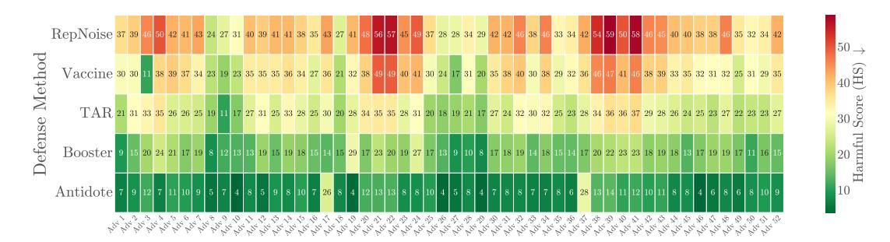

# Antidote and hypernets:

- [Antidote: Bi-level Adversarial Training for Tamper-Resistant LLMs](https://arxiv.org/pdf/2509.08000)

[**CODE IS ACTUALLY AVAILABLE**](https://github.com/respailab/Antidote)

Highlight: 
> *We deliberately assume this powerful adversary, one who is not limited by a specific attack algorithm or budget, to ensure our defense is robust against unforeseen and future attack strategies.*
>
> *The adversary's objective is to select a fine-tuning action A from the space of all possible strategies, A, to maximize the model's propensity to generate harmful content*:
>
> $$\max_{A \in \mathcal{A}} \quad \mathbb{E}_{(x_s, y_s, y_h) \sim \mathcal{D}_{\text{safe}}}[\log P(y_h | x_s; A(\theta))] \tag{1}$$

($y_h$ is the harmful response, $x_s$ is the safe prompt, and $y_s$ is the safe response. The adversary wants to maximize the probability of generating $y_h$ given $x_s$ after applying the fine-tuning strategy $A$ to the model parameters $\theta$.)

> A truly resilient model is one that maintains its safety alignment even after the adversary has performed their worst-case attack. This naturally leads to a min-max optimization problem, where we seek to find parameters  $\theta$  that minimize the harm after the adversary has done their best to maximize it, all while preserving the model's core utility.
> $$\theta^* = \arg\min_{\theta} \left( \max_{A \in \mathcal{A}} \mathcal{L}_{\text{harm}}(A(\theta)) \right) \tag{2}$$
> subject to  $\mathcal{L}_{\text{cap}}(\theta) \le \epsilon$ 
> - $\mathcal{L}_{\text{harm}}(\theta) = -\mathbb{E}_{(x_s,y_s,y_h)\sim\mathcal{D}_{\text{safe}}}[\log\sigma(\pi_{\theta}(y_s|x_s) - \pi_{\theta}(y_h|x_s))]$  is a kind of negative DPO safety loss. This choice aligns with prior work that also leveraged DPO loss for its inherent suitability to this problem [(Tamirisa et al. 2024)](https://arxiv.org/abs/2408.00761). (Note that the adversary seeks to agument $\mathcal{L}_{\text{harm}}$, while the defender aims to minimize it. Maybe the name of this "loss" should be changed to "harm score" or something like that, since the adversary is trying to maximize it.)
> - $\mathcal{L}_{cap}(\theta)$  is a loss function measuring performance on the capability distribution  $\mathcal{D}_{cap}$ .
> - $\epsilon$  is a small constant representing the maximum tolerable degradation in general capabilities.

## Where does the hypernet come in?

These fellas use **bilevel optimization**. The inner loop is:

$$\max_{A \in \mathcal{A}} \mathcal{L}_{\text{harm}}(A(\theta))$$

To solve the outer minimization over $\theta$, you need the gradient of the inner maximum with respect to $\theta$. But the inner maximum $A^*(\theta)$ is itself a function of $\theta$ — you'd need to differentiate *through the entire inner optimization process*, which is computationally intractable.

**The first-order approximation** (used in methods like TAR/meta-learning approaches) sidesteps this by approximating $A^*(\theta)$ with just **one or a few gradient steps** of the inner loop, rather than running it to convergence. Concretely:

$$A(\theta) \approx \theta + \alpha \nabla_\theta \mathcal{L}_{\text{harm}}(\theta)$$

This is essentially the same trick used in **MAML** (Model-Agnostic Meta-Learning). You pretend a single gradient step is a good enough proxy for the adversary.

**Why this is biased:** The true worst-case adversary requires many steps of fine-tuning to find. A single-step approximation undershoots — the simulated attack is weaker than a real one, so the defender is hardened against a strawman adversary. The gradient signal for the outer loop is therefore biased toward underestimating the threat.

**AntiDote's claim** is that the hypernetwork sidesteps this entirely — since the hypernetwork generates attacks in a single forward pass, there's no inner loop to approximate at all, giving clean unbiased gradients.

## The Adversarial Hypernetwork $H_\phi$

The hypernetwork $H_\phi$ (parameterized by $\phi$) replaces the intractable fine-tuning adversary. It is a **differentiable neural network** that directly generates adversarial LoRA weight updates for a target layer $l$:

$$(\mathbf{U}_l, \mathbf{V}_l) = H_\phi(\mathbf{X}_l(x; \theta)) \tag{3}$$

where $\mathbf{U}_l \in \mathbb{R}^{r \times d_{\text{in}}}$ and $\mathbf{V}_l \in \mathbb{R}^{d_{\text{out}} \times r}$ are the generated LoRA matrices of rank $r$, and $\mathbf{X}_l = \{a_1, \ldots, a_N\}$ are the **internal activations** of the defended model at layer $l$ when processing prompt $x$. The adversarial weight update is then:

$$\Delta W_l = \mathbf{V}_l^T \mathbf{U}_l$$

**Key advantages of the hypernetwork route:**

1. **Computational efficiency**: generating an attack is a single forward pass through $H_\phi$, orders of magnitude faster than even one step of fine-tuning. Crucially, the cost is *constant* regardless of the target LLM size.
2. **Full differentiability**: the entire pipeline is end-to-end differentiable, so gradients flow cleanly from the defender's loss back through the hypernetwork, with no first-order approximations or Hessian terms to worry about.
3. **State-awareness**: the input to $H_\phi$ is not a static embedding of the harmful prompt but the **live internal activations** of the defender. This means the adversary attacks the model's *reasoning process*, not just the surface semantics of the prompt. As the defender evolves during training, the activations change, and so does the attack — creating a true co-evolutionary arms race.

**Architecture of $H_\phi$** (multi-stage):
- **Input stage**: activation vectors $\mathbf{X}_l$ are projected and processed by a **self-attention mechanism**, allowing the network to identify the most salient/"vulnerable" activation patterns relationally rather than just averaging them.
- **Core**: a deep stack of **residual feed-forward blocks** maps the pooled attention output to adversarial parameter space.
- **Output stage**: a **multi-headed architecture** with dimension-specific heads for each unique layer configuration (e.g., `q_proj` vs `mlp.down_proj`), enabling knowledge transfer across layer types while handling heterogeneous dimensions.

## The Bi-level Optimization Game

Training proceeds as an **interleaved $k:k$ schedule**, alternating between two phases. A static adversary would become stale as the defender improves — the interleaving ensures the adversary continuously adapts.

### Phase 1: Adversary's Turn (Maximization)

Freeze defender $\theta_D$, train $\phi$. The hypernetwork generates a patch based on current defended model activations:

$$\theta_{\text{adv}} = (\theta_{\text{base}} + \theta_D) \oplus H_\phi(\mathbf{X}_l(x_s; \theta_{\text{base}} + \theta_D))$$

The adversary maximizes (implemented as minimizing the negative):

$$\mathcal{L}_{\text{adv}}(\phi) = \mathbb{E}_{(x_s,y_s,y_h)\sim\mathcal{D}_{\text{safe}}}[\log\sigma(\pi_{\theta_{\text{adv}}}(y_h|x_s) - \pi_{\theta_{\text{adv}}}(y_s|x_s))] \tag{4}$$

### Phase 2: Defender's Turn (Minimization)

Freeze $\phi$, train $\theta_D$. Two **decoupled** objectives:

**Safety loss** (computed on the *attacked* model):
$$\mathcal{L}_{\text{safe}}(\theta_D) = -\mathbb{E}_{(x_s,y_s,y_h)\sim\mathcal{D}_{\text{safe}}}[\log\sigma(\pi_{\theta_{\text{adv}}}(y_s|x_s) - \pi_{\theta_{\text{adv}}}(y_h|x_s))] \tag{5}$$

**Capability loss** (computed on the *clean* model, no adversarial patch):
$$\mathcal{L}_{\text{cap}}(\theta_D) = \mathbb{E}_{x_c, y_c \sim \mathcal{D}_{\text{cap}}}[\mathcal{L}_{\text{CE}}(M_{\theta_{\text{base}}+\theta_D})] + \beta \cdot D_{\text{KL}}(P(y|x_c; \theta_{\text{base}}+\theta_D) \| P(y|x_c; \theta_{\text{base}})) \tag{6}$$

**Total defender loss:**
$$\mathcal{L}_{\text{defender}} = \mathcal{L}_{\text{safe}} + \lambda \mathcal{L}_{\text{CE}} + \beta \mathcal{L}_{\text{KL}}$$

with $\lambda = 0.8$, $\beta = 0.3$ (empirically validated via ablations).

**Why decoupling matters (gradient purity):** if $\mathcal{L}_{\text{cap}}$ were computed on the attacked model, the capability gradient would be "contaminated" by the adversarial objective — the defender would receive a muddled signal trying to solve two conflicting problems simultaneously, causing catastrophic forgetting. By computing $\mathcal{L}_{\text{cap}}$ on the clean model, the defender learns *helpfulness* and *safety* as two independent, non-interfering skills. Ablations confirm this: the coupled variant loses **5+ absolute points of Fine-tune Accuracy** while barely changing Harmful Score (Table 5).

After training, defender weights are merged: $\theta^* = \theta_{\text{base}} + \theta_D$.

## Experimental Setup

- **Safety data** ($\mathcal{D}_{\text{safe}}$): BeaverTails + do-not-answer, covering **16 harm categories** (animal abuse, child abuse, discrimination, drug/weapons, financial crime, hate speech, misinformation, self-harm, terrorism, violence, etc.)
- **Capability data** ($\mathcal{D}_{\text{cap}}$): LIMA + Unnatural Instructions + MATH — deliberately broad to prevent catastrophic forgetting.
- **Evaluation — safety**: 1,300 harmful instructions from BeaverTails, StrongREJECT, HarmBench, XSTest, DAN. Metric: **Harmful Score (HS)** = % unsafe outputs.
- **Evaluation — utility**: 3,500 samples from MMLU, GSM8K, HellaSwag, PrOntoQA. Metric: **Fine-tune Accuracy (FA)**.
- **Models**: 10 open-weight models, 0.6B–27B params (Qwen, Llama, Falcon, Aya, Gemma, Mistral families).
- **Baselines**: SFT, RMU (unlearning), TAR, RepNoise, Vaccine, Booster.
- **Hardware**: 3× NVIDIA A6000. AdamW, 8 epochs, defender LoRA rank=16, alpha=32, lr=3e-5; adversary lr=2e-4.

## Results

### Safety vs. Utility Trade-off (Table 1)

Fine-tuning on benign capability benchmarks (20:80 harmful:benign split):

| Method   | MMLU FA↑ | MMLU HS↓ | GSM8K FA↑ | GSM8K HS↓ | HellaSwag FA↑ | HellaSwag HS↓ | PrOntoQA FA↑ | PrOntoQA HS↓ | Avg FA↑ | Avg HS↓ |
|----------|-----------|-----------|------------|------------|----------------|----------------|--------------|--------------|---------|---------|
| SFT      | 75.2      | 15.5      | 35.1       | 14.8       | 85.6           | 16.1           | 68.9         | 14.2         | 66.2    | 15.2    |
| RMU      | 73.1      | 12.4      | 33.5       | 11.9       | 83.9           | 13.0           | 66.2         | 11.5         | 64.2    | 12.2    |
| Booster  | 75.0      | 7.1       | 34.3       | 6.5        | 85.4           | 8.8            | 68.0         | 6.9          | 65.8    | 7.3     |
| TAR      | 74.5      | 9.8       | 34.2       | 9.1        | 84.8           | 10.5           | 67.5         | 9.5          | 65.3    | 9.7     |
| RepNoise | 74.1      | 11.5      | 33.9       | 10.8       | 84.2           | 12.1           | 67.0         | 11.1         | 64.8    | 11.4    |
| Vaccine  | 74.8      | 8.5       | 34.5       | 7.9        | 85.1           | 8.5            | 67.9         | 8.1          | 65.6    | 8.4     |
| **AntiDote** | **75.8** | **3.1** | **35.5** | **8.8**  | **86.1**       | **6.4**        | **68.3**     | **6.8**      | **66.4** | **6.3** |

AntiDote achieves **highest FA and lowest HS simultaneously** — the only method to do so. All others show a clear safety-utility trade-off.

### Robustness Across Models (Table 2)

After harmful fine-tuning (20:80 harmful:benign):

| Model            | SFT HS↓ | Booster HS↓ | TAR HS↓ | AntiDote HS↓ | AntiDote FA↑ |
|------------------|---------|-------------|---------|--------------|--------------|
| Qwen-2.5-0.6B    | 31.5    | 8.1         | 24.1    | **5.1**      | 88.5         |
| Llama-3.2-3B     | 33.7    | 8.3         | 25.8    | **5.3**      | 90.8         |
| Falcon-H1-7B     | 36.2    | 8.6         | 27.2    | **5.7**      | 91.9         |
| Llama-3.1-8B     | 38.1    | 8.8         | 28.5    | **5.9**      | 92.8         |
| Qwen-2.5-7B      | 37.5    | 9.1         | 28.1    | **6.9**      | 92.2         |
| Aya-expanse-8B   | 39.4    | 9.6         | 29.8    | **9.8**      | 93.3         |
| Gemma-3-12B      | 40.8    | 9.5         | 30.4    | **9.4**      | 93.9         |
| Qwen-2.5-14B     | 41.5    | 9.9         | 31.0    | **7.2**      | 93.2         |
| Mistral-Small-24B| 43.1    | 10.8        | 32.1    | **8.5**      | 95.0         |
| Gemma-3-27B      | 44.2    | 13.5        | 33.0    | **9.8**      | 95.3         |

On Gemma-3-27B: **78% HS reduction** vs SFT, while achieving the **highest FA (95.3)** of any method.

### Red-Teaming Across 52 Attacks (Figure 2)

Figure 2: Per-attack harmfulness heatmap across 52 red-teaming attacks. Rows = defense methods, columns = attacks. Darker green = lower HS. AntiDote (bottom row) is consistently the darkest.

AntiDote is **up to 27.4% more robust** than baselines averaged across all 52 attacks. Particularly strong on:
- **Adversarial Suffixes (Adv 19)** and **Role-Playing (Adv 4)**: attacks that manipulate internal state rather than surface semantics — the hypernetwork detects the anomalous activation patterns these produce.

Weaknesses: for **Hypothetical Framing (Adv 37)** and **Distractor Instructions (Adv 17)**, Booster/TAR marginally outperform AntiDote. These attacks flood the model with benign context, making the internal state *look* normal — fooling the hypernetwork's anomaly detector.

### Varying Harmful Data Ratio (Table 6, Qwen-2.5-7B)

| Method   | HS clean | HS p=0.05 | HS p=0.15 | HS p=0.2 | Avg HS↓ | Avg FA↑ |
|----------|----------|-----------|-----------|----------|---------|---------|
| SFT      | 1.50     | 25.10     | 48.20     | 60.50    | 33.83   | 89.80   |
| TAR      | 1.10     | 15.80     | 40.30     | 52.10    | 27.33   | 90.43   |
| Booster  | 2.10     | 5.10      | 15.80     | 24.90    | 11.98   | 91.78   |
| **AntiDote** | 2.10 | **4.50** | **13.70** | **20.10** | **10.10** | **92.25** |

AntiDote degrades more gracefully under increasing attack strength — Booster's HS grows ~5x from p=0.05 to p=0.2, while AntiDote's grows more slowly and stays lower in absolute terms. This is attributed to the co-evolutionary training: as p increases, the adversary learns stronger attacks, hardening the defender proportionally.

**Honest caveat from the authors:** at p=0 (clean), TAR achieves slightly lower HS than AntiDote. The constant adversarial pressure instills a "defensive posture" that is slightly suboptimal when there is literally no threat.

### Computational Cost (Table 3)

| Method   | 3B Time (h) | 3B Mem (GB) | 7B Time (h) | 7B Mem (GB) | 12B Time (h) | 12B Mem (GB) |
|----------|-------------|-------------|-------------|-------------|--------------|--------------|
| SFT      | 0.21        | 28.5        | 0.36        | 49.3        | 0.52         | 70.1         |
| Booster  | 0.63        | 35.1        | 1.86        | 57.9        | 3.15         | 82.5         |
| RepNoise | 1.74        | 43.2        | 3.56        | 68.9        | 5.82         | 100.1        |
| TAR      | 1.22        | 41.5        | 3.15        | 65.5        | 5.35         | 95.8         |
| **AntiDote** | 0.69    | 32.4        | 1.97        | 51.2        | **3.17**     | **73.6**     |

AntiDote is nearly as fast as Booster while using significantly less memory (73.6 vs 82.5 GB at 12B). Three engineering choices enable this:
1. **Fully parameter-efficient training**: both defender and adversary use LoRA, minimizing optimizer memory.
2. **Reference-free DPO**: no need to store a separate reference model in VRAM — the reference state is recovered by swapping to the original LoRA adapter.
3. **CPU offloading** of the inactive player during the interleaved schedule.

## Ablations

### State-Awareness is Essential (Table 4)

Comparing full AntiDote vs **AntiDote-Static** (hypernetwork receives a static prompt embedding instead of live activations):

| Model        | Method  | HS↓  | FA↑  |
|--------------|---------|------|------|
| Llama-3.2-3B | Full    | 5.7  | 90.8 |
|              | Static  | 33.1 | 90.3 |
| Gemma-3-12B  | Full    | 9.1  | 93.9 |
|              | Static  | 31.5 | 93.5 |
| Gemma-3-27B  | Full    | 9.9  | 95.3 |
|              | Static  | 34.8 | 94.9 |

HS is **3–5× higher** in the static variant. A static adversary becomes stale as the defender evolves — it attacks an outdated version of the defender's reasoning. The live activations are what make the arms race real.

### Decoupled Loss is Essential (Table 5)

Comparing full AntiDote vs **AntiDote-Coupled** (capability loss computed on the attacked model alongside the safety loss):

| Model        | Method  | HS↓ | FA↑  |
|--------------|---------|-----|------|
| Llama-3.2-3B | Full    | 8.5 | 90.8 |
|              | Coupled | 9.1 | 85.4 |
| Gemma-3-12B  | Full    | 5.9 | 93.9 |
|              | Coupled | 6.4 | 89.1 |
| Gemma-3-27B  | Full    | 5.1 | 95.3 |
|              | Coupled | 5.5 | 90.2 |

HS barely changes, but FA **collapses by 5+ points** on the largest model. The confounded gradient forces the defender to compromise between being helpful and resisting the attack simultaneously, producing a brittle solution where helpfulness becomes entangled with the defensive posture.