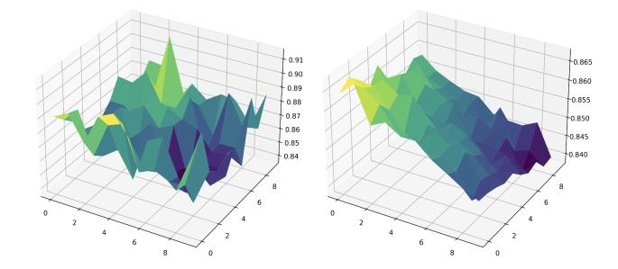
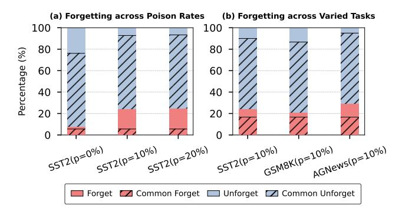

# Data Vulnerability Aware Immunisation

Taken from the  [Vulnerability Aware Alignment](https://arxiv.org/pdf/2506.03850)  paper by Chen et al.

## Positioning in the Immunisation Landscape

VAA lives squarely in the **alignment-stage defence** family: like Vaccine and Booster, it modifies
how the model is trained during alignment (Stage 1), before any user fine-tuning happens. The
defender's hope is that a more robust aligned model will resist the parameter shifts that HFT induces.

**Where it inherits from.** The method is a direct synthesis of two well-established frameworks:

- **SAM (Sharpness-Aware Minimisation, Foret et al. 2021):** the Taylor expansion trick for
  approximating the worst-case weight perturbation $\epsilon_i^*$ is lifted straight from SAM. In
  SAM this was used to find flat minima for generalisation; here it's repurposed to find the
  directions of greatest safety fragility per data group.
- **Group DRO (Sagawa et al. 2020):** the outer GDRO objective and the EXP3-style mirror ascent
  update for the sampling distribution $q$ come directly from the Group DRO literature on
  subpopulation robustness. VAA is essentially Group DRO + SAM, applied to alignment data
  partitioned by vulnerability.

**The core conceptual contribution** is the empirical observation that alignment data is *not
homogeneous* in its susceptibility to HFT: some examples sit in sharper, less stable regions of
the loss landscape and get "forgotten" first when a user fine-tunes. VAA formalises this as a
two-group structure (vulnerable / invulnerable) and then lets Group DRO dynamically up-weight
whichever group the model currently struggles with most.

**Relation to adjacent work in this tutorial.** Compared to Vaccine (which adds uniform
embedding perturbations during alignment) and Booster (which attenuates harmful perturbation
gradients), VAA is more *data-aware*: the perturbation magnitude and the sampling frequency are
both group-dependent and adaptive. Compared to weight-space methods like LoX, VAA operates
entirely in parameter-gradient space and requires no SVD or post-hoc extrapolation. Compared to
bi-level methods like TAR or Antidote, it is strictly an alignment-stage method — it does not
simulate the attacker's fine-tuning trajectory at all, which makes it cheaper but also less
principled in its threat modelling.

## Their strategy:

They use a two-player game between the LLM and an adversarial sampler. The sampler's job is to find the "vulnerable" data groups that the LLM struggles with, and the LLM's job is to improve on those groups. The sampler updates its distribution over groups using a mirror ascent step (the EXP3 algorithm), while the LLM updates its parameters using gradient descent on a robust objective that includes a perturbation term to simulate vulnerability. 

### The llm:

They create a robust objective for training that goes beyond equally sampling data and beyond using it "as is". 

Let $\Theta$ denote the parameter space of the LLM, and let $\ell : \Theta \times (X \times Y) \to \mathbb{R}^+$ be a nonnegative loss function measuring the discrepancy between the model's prediction and the true output. The surrogate objective is defined as:

$$f_i(\theta) = \ell_i(\theta) + \lambda \underbrace{(\ell_i(\theta + \epsilon_i) - \ell_i(\theta))}_{\text{robustness of } i\text{-th group}} \tag{4}$$

$$= (1 - \lambda)\ell_i(\theta) + \lambda\ell_i(\theta + \epsilon_i) \tag{5}$$

Here, $\ell_i(\theta)$ denotes the loss for group $G_i$ , and $\epsilon_i$ represents a worst-case perturbation applied to the model parameters for that group. The *robustness* term, $\ell_i(\theta + \epsilon_i) - \ell_i(\theta)$, quantifies the group's *sensitivity* to parameter shifts. [They should have called it *fragility* or *vulnerability* term instead...] This term is group-specific, reflecting the empirical observation that different groups exhibit varying levels of vulnerability to weight perturbations.

> *The objective function linearly interpolates between the original loss and the perturbed loss, enabling a smooth transition from standard learning to robust learning. To facilitate this transition, we adopt a curriculum learning strategy, gradually increasing $\lambda$ from 0 to 1 during training. This allows the model to first focus on finding a valid alignment solution and subsequently improve its robustness to potential parameter shifts.*

Implicitly, $\epsilon_i$ was called "a worst-case perturbation applied to the model parameters for group i" but never given a formula. Implicitly, it's defined as the solution to:

$$\epsilon_i = \arg\max_{\|\epsilon\| \leq \alpha} \ell_i(\theta + \epsilon)$$

i.e., the perturbation *within a ball of radius α* that maximally increases the loss. This is the inner maximisation problem — you want to find the scariest possible weight shift for group $i$, and then train to be robust against it.

The problem is this inner max is expensive to solve exactly. So they borrow the trick from SAM [(Sharpness-Aware Minimization, Foret et al. 2021)](https://arxiv.org/abs/2010.01412).

#### The Taylor expansion trick

Do a first-order Taylor expansion of the loss around θ:

$$\ell_i(\theta + \epsilon) \approx \ell_i(\theta) + \epsilon^\top \nabla \ell_i(\theta)$$

Now maximise over $\epsilon$ subject to $\|\epsilon\| \leq \alpha$. The first term doesn't depend on $\epsilon$, so you just need to maximise $\epsilon^\top \nabla \ell_i(\theta)$. By Cauchy-Schwarz, this is maximised when $\epsilon$ points in the exact same direction as the gradient, with maximum norm $\alpha$. So:

$$\epsilon_i^* = \alpha \cdot \frac{\nabla \ell_i(\theta)}{\|\nabla \ell_i(\theta)\|}$$

That's it. It's just saying: **the worst-case perturbation to the weights is the one that goes uphill in loss as steeply as possible**, and the gradient direction tells you exactly which way that is.


Figure 3 from the paper.

So $\epsilon_i$ is not a separate learned thing — it's computed on-the-fly from the current gradient during training, for each group separately. So for the vulnerable group, $\epsilon_i$ points in the direction of steepest ascent *on the vulnerable data*, which tends to be a sharper, more dramatic direction (because vulnerable data sits in sharper loss landscape regions, as shown in Figure 3). This makes the robust objective in eq. (5) specifically harder for the vulnerable group, forcing the model to flatten out exactly where it needs to.


### The adversary:

These fellas use sampling when doing alignment. They use an adversary that samples samples that are "vulnerable" in the sense that they would live on a very unstable region of the loss landscape if training is done normally.

$$\hat{\theta}_{\text{DRO}} = \arg\min_{\theta \in \Theta} \left\{ \sup_{G_i \in Q} \mathbb{E}_{(x,y) \sim G_i}[f_i(\theta; (x,y))] \right\} \tag{7}$$

The `sup` is a supremum over groups $G_i$ within the ambiguity set $Q$, where $Q$ is the set of all convex combinations of data groups (vulnerable and invulnerable), so it's a simplex of possible "which group to weight". The `sup` is asking: *among all ways to mix the groups, which mixture gives the highest loss right now?* In the two-group case this essentially just picks the worse-performing group. So the whole thing reads: **find $\theta$ that minimises the worst-case group loss** — that's the Group DRO objective. The `sup` is the adversary's move: it picks the hardest group, then you minimise against it.


### Implementing that optimisation:

$$q^{(t)} = \arg\max_{q \in \Delta^{m-1}} \left\{ \eta_q \langle q, f^{(t)} \rangle - D_\psi(q \| q^{(t-1)}) \right\} \tag{9}$$

The first term $\langle q, f^{(t)} \rangle$ is literally $\sum_i q_i f_i(\theta^{(t-1)})$ — the **expected objective value under the distribution $q$ over groups**. Since $f^{(t)}$ is the vector of current per-group losses, this inner product is just the weighted average loss where $q$ provides the weights.

Why maximise it? You're updating the adversarial sampler $q$, and you want $q$ to concentrate probability mass on whichever group is currently hardest (highest $f_i$). Maximising $\langle q, f^{(t)} \rangle$ over the simplex is exactly equivalent to putting all weight on the group with the highest current loss — but the Bregman divergence term $D_\psi(q \| q^{(t-1)})$ acts as a trust-region regulariser, preventing $q$ from jumping too aggressively in one step (it's the "mirror" part of mirror ascent, keeping updates smooth on the simplex).

So the whole thing is: **"shift sampling probability toward the currently worst-performing group, but don't do it too violently."** Then the LLM (the minimiser) has to get better on that group, and so on — it's a two-player game where the sampler keeps finding the weak spot and the model has to patch it.

Actually there is a piece missing yet:


*To solve the problem, we introduce a Lagrangian with multiplier  $\lambda$  to enforce the probability simplex constraint  $\sum_{i=1}^{m} q_i = 1$ :*

$$L(q,\lambda) = \sum_{i=1}^{m} q_i \left[ \eta_q f_i + \log \frac{q_i}{q_i^{(t-1)}} \right] + \lambda \left( \sum_{i=1}^{m} q_i - 1 \right) \tag{11}$$


Taking the derivative of  $L(q, \lambda)$  with respect to  $q_i$  and setting it to zero yields:

$$q_i^{(t)} = \frac{q_i^{(t-1)} \exp\left(\eta_q f_i(\theta^{(t-1)})\right)}{Z}, \tag{12}$$
where:
$$Z = \sum_{j=1}^{m} q_j^{(t-1)} \exp (\eta_q f_j(\theta^{(t-1)})).$$

This update aligns with the EXP3 algorithm [(Auer et al., 2002)](https://epubs.siam.org/doi/abs/10.1137/S0097539701398375) in the adversarial bandit problem, where each group corresponds to an arm and the observed reward for arm i is adjusted by its sampling probability  $q_i^{(t-1)}$  to ensure unbiasedness:

$$r_i^{(t)} = \frac{f_i(\theta^{(t-1)})\mathbb{I}[i_t = i]}{q_i^{(t-1)}},\tag{13}$$

where  $\mathbb{I}[i_t = i]$  is the indicator function that equals 1 if arm i is selected at time t, and 0 otherwise.


### Algorithm Sumary:

**The sampler (adversary) — equations (7) through (13):** The sampler needs to update $q$, its distribution over groups. Eq (11) is the Lagrangian introduced purely to solve the constrained optimisation for $q$ analytically — you take the derivative w.r.t. $q_i$, set to zero, and out pops the closed-form update in eq (12), the EXP3-style exponential reweighting. No gradient descent involved here at all, just a closed-form solution.

**The LLM (defender) — objective function $f_i$ from equation (5):** The LLM does gradient descent on $f_i(\theta) = (1-\lambda)\ell_i(\theta) + \lambda\ell_i(\theta + \epsilon_i)$, the robust objective defined way back in section 3.1. The paper says this explicitly at the end of section 3.3: *"the LLM optimizes its performance under this challenge by performing gradient descent on objective function f."* That $f$ refers to eq (5).

So the training loop at each iteration is:
1. Sampler picks a group $G_i$ by sampling from $q$ (the distribution over vulnerable/invulnerable)
2. Compute $\epsilon_i$ via the gradient/Taylor trick
3. Evaluate the robust loss $f_i$ on the sampled group with the perturbed weights
4. **LLM does gradient descent on $f_i$** ← this is the actual parameter update
5. Compute reward $r_i$ and update $q$ via the EXP3 closed-form (eq 12)

Here are the two pieces:

---

## Piece 1: Introduction / Positioning

```markdown
## Positioning in the Immunisation Landscape

VAA lives squarely in the **alignment-stage defence** family: like Vaccine and Booster, it modifies
how the model is trained during alignment (Stage 1), before any user fine-tuning happens. The
defender's hope is that a more robust aligned model will resist the parameter shifts that HFT induces.

**Where it inherits from.** The method is a direct synthesis of two well-established frameworks:

- **SAM (Sharpness-Aware Minimisation, Foret et al. 2021):** the Taylor expansion trick for
  approximating the worst-case weight perturbation $\epsilon_i^*$ is lifted straight from SAM. In
  SAM this was used to find flat minima for generalisation; here it's repurposed to find the
  directions of greatest safety fragility per data group.
- **Group DRO (Sagawa et al. 2020):** the outer GDRO objective and the EXP3-style mirror ascent
  update for the sampling distribution $q$ come directly from the Group DRO literature on
  subpopulation robustness. VAA is essentially Group DRO + SAM, applied to alignment data
  partitioned by vulnerability.

**The core conceptual contribution** is the empirical observation that alignment data is *not
homogeneous* in its susceptibility to HFT: some examples sit in sharper, less stable regions of
the loss landscape and get "forgotten" first when a user fine-tunes. VAA formalises this as a
two-group structure (vulnerable / invulnerable) and then lets Group DRO dynamically up-weight
whichever group the model currently struggles with most.

**Relation to adjacent work in this tutorial.** Compared to Vaccine (which adds uniform
embedding perturbations during alignment) and Booster (which attenuates harmful perturbation
gradients), VAA is more *data-aware*: the perturbation magnitude and the sampling frequency are
both group-dependent and adaptive. Compared to weight-space methods like LoX, VAA operates
entirely in parameter-gradient space and requires no SVD or post-hoc extrapolation. Compared to
bi-level methods like TAR or Antidote, it is strictly an alignment-stage method — it does not
simulate the attacker's fine-tuning trajectory at all, which makes it cheaper but also less
principled in its threat modelling.
```

---

### Experiments


VAA is evaluated on **LLaMA-2 7B** and **Qwen2.5 7B**, with full-parameter training throughout (both alignment and HFT stages). The alignment dataset is 2,000 samples from BeaverTails. HFT is evaluated across four downstream tasks: SST-2, AG News, GSM8K, and AlpacaEval, with a default 10% harmful data mixture. Metrics are Harmful Score (HS, proportion of harmful outputs on unseen malicious instructions, lower is better) and Fine-tuning Accuracy (FA, task performance, higher is better).

#### Baselines compared

| Baseline | Type | Core idea |
|---|---|---|
| SFT | Vanilla alignment | No defence |
| Vaccine | Alignment-stage | Uniform embedding perturbation during alignment |
| RepNoise | Alignment-stage | Reduces mutual information between harmful reps and outputs |
| Booster | Alignment-stage | Attenuates harmful perturbation gradients |

VAA consistently beats all four on HS across tasks and harmful ratios, while matching or
exceeding FA. The gains are most dramatic on complex tasks: on GSM8K and AlpacaEval, RepNoise
and Booster actually *increase* harmful scores relative to SFT, while VAA continues to reduce
them. The curriculum learning schedule also makes VAA cheaper than Vaccine and Booster
(approximately 1.5× BP vs. 2× and 3× respectively).

A notable cross-model result: group labels estimated on LLaMA-2 transfer to Qwen2.5 without
re-clustering, supporting the claim that vulnerability is a property of the data rather than the
model architecture.

### What's missing from the comparison

**Antidote** is the most glaring omission. It appeared almost simultaneously (days later) and
addresses the *exact same threat model* — alignment-stage defence against HFT in a
fine-tuning-as-a-service setting. Antidote uses a differentiable hypernetwork adversary in a
bi-level game, generating dynamic LoRA-based attacks rather than simple gradient-direction
perturbations. On comparable settings Antidote substantially outperforms the same baselines VAA
compares against, which puts VAA's headline numbers in a different light. The two papers have
never been compared head-to-head.

**TAR** is also absent. TAR simulates the full fine-tuning trajectory of the attacker in its inner
loop, which is a fundamentally stronger threat model than VAA's single-step gradient perturbation.
TAR is more expensive but more principled; the comparison would clarify exactly how much of
VAA's gain comes from the data-grouping insight versus from the perturbation objective.

**LoX** is not compared to either, operating in a complementary regime (training-free, post-hoc
weight-space extrapolation), but a combined pipeline of VAA alignment followed by LoX
extrapolation would be a natural and interesting experiment.

### Some final notes:

Interesting remarks for consideration in future research:

 - The **full-parameter training** setup is a deliberate worst-case choice but not the most common
deployment reality. Most fine-tuning-as-a-service providers use LoRA. Results under LoRA
fine-tuning would likely be more favourable for all methods, and the relative ranking may differ.

- The **data grouping procedure** requires running a proxy HFT simulation upfront (fine-tuning on
Alpaca + 10% harmful data and watching which alignment examples flip). This is a non-trivial
preprocessing cost that the computational overhead section underplays — it's framed as a one-time
cost but it does require access to some representative harmful data and an assumption that
vulnerability patterns generalise to the real downstream attack. The cross-model transfer result
is encouraging but still narrow (one LLaMA → one Qwen transfer).

- The **threat model is relatively weak**: a single gradient step approximation for $\epsilon_i$
means the method trains robustness against a very local perturbation. Methods like TAR and
Antidote simulate multi-step attackers. As the paper itself notes, harmful scores still rise
monotonically with HFT epochs and harmful data ratio — VAA slows the degradation but does not
stop it.

- Finally, VAA's framing around "uneven forgetting" is genuinely novel and the empirical
observation (some data subsets are consistently more vulnerable across architectures and tasks)
is interesting and underexplored. Even if stronger methods exist end-to-end, the *data
perspective* it opens up — asking which alignment examples are structurally fragile and why —
is a contribution worth highlighting independently of the final numbers.

> 
*Figure 2: Analysis of forgetting behavior: (a) Forgetting patterns on a fine-tuning task (SST2) with varying poison rates (0%, 10%, and 20%); (b) Forgetting patterns across three different fine-tuning tasks (SST2, GSM8K, and AGNews) with a fixed 10% poison rate.*


