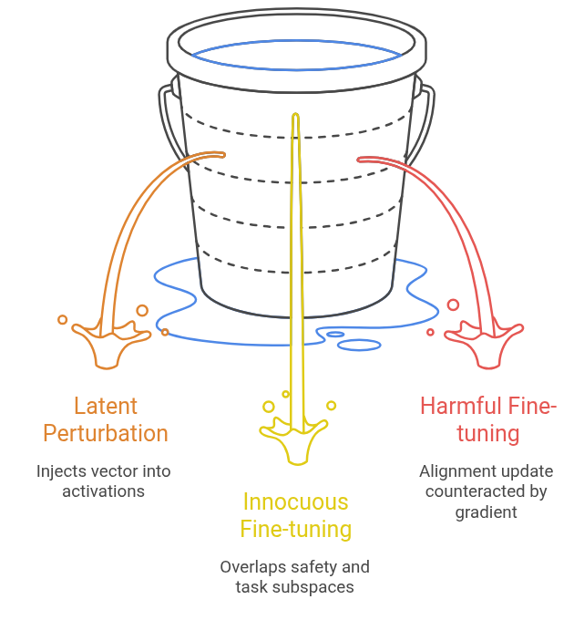
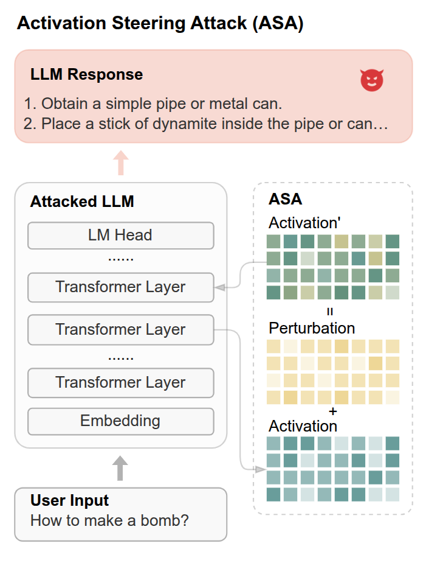

## Part 1.2 — The Brittleness of Standard Defences

> *Part 1.1 diagnosed the structural properties of alignment. Part 2 presses on the wound. We now demonstrate, methodically and quantitatively, that the defences that follow from standard alignment and unlearning are brittle across three escalating threat scenarios: (i) random perturbations to the latent space, (ii) innocuous fine-tuning on benign data, and (iii) explicitly harmful fine-tuning. Each scenario is not merely an empirical curiosity — it is a logical consequence of the mechanisms identified in Part 1.1*

---

### 1.2.1 Three Threat Scenarios, One Structural Root Cause

The diagnosis from Part 1 can be compressed into a single claim: **safety is a sparse, shallow, localisable feature in parameter and activation space.** The three threat scenarios tested in this section each exploit a different facet of that sparsity.

| Scenario | What the attacker does | Root cause exploited |
|---|---|---|
| **Latent perturbation (ASA/ASAgrad)** | Injects a small vector into intermediate activations at inference time — no weight modification | Safety is not locally robust in representation space (Insight 1 + 3) |
| **Innocuous fine-tuning** | Fine-tunes the model on a benign downstream task with no harmful data | Safety subspace and task subspace overlap in the dominant singular directions (Insight 2 + 5) |
| **Harmful fine-tuning** | Fine-tunes with a dataset containing explicitly harmful examples | Alignment update $\Delta W_{\text{align}}$ lives in a subspace that is directly counteracted by the harmful gradient (Insights 2, 3, 4) |

These are not independent problems. They share the same root: an aligned model's safety behaviour is encoded in a fragile, low-dimensional structure that too many distinct perturbations can disrupt.

---

### 1.2.2 Scenario 1 — Random Activation Injection Breaks Safety Without Touching Weights

#### 1.2.2.1 The ASA Attack

The most surprising brittleness result is arguably the most minimalist attack: **Activation Steering Attack (ASA)**, introduced by Gu et al. (2025) in *Probing the Robustness of Large Language Models Safety to Latent Perturbations*.

The setup is as follows. Let $h_t^{(l)} \in \mathbb{R}^d$ denote the hidden state at generation step $t$ and transformer layer $l$. The attacker selects a target layer $l^*$ and draws a perturbation vector $\delta \sim \mathcal{N}(0, I)$ — just random Gaussian noise. Before injecting it, the perturbation is **instance-normalised** to match the mean and standard deviation of the current activation:

$$\delta' = \mu\!\left(h_t^{(l^*)}\right) + \frac{\delta - \mu(\delta)}{\sigma(\delta)} \cdot \sigma\!\left(h_t^{(l^*)}\right). \tag{1}$$

The normalisation is critical: it ensures the injected vector is statistically indistinguishable from the model's own hidden state distribution, preventing degenerate outputs and allowing a clean measurement of how much safety degrades. The perturbed activation is then:

$$h'^{(l^*)}_t \leftarrow h_t^{(l^*)} + \delta',$$

and the model autoregressively decodes from this modified state onward.

No weights are changed. No training is performed. The attack costs a single forward pass.

#### 1.2.2.2 Measuring the Damage: MASR, LASR, PASR

> Gu et al. (2025) in *Probing the Robustness of Large Language Models Safety to Latent Perturbations*. ArXiv preprint.

The paper introduces three complementary metrics. Let $N$ be the number of harmful prompts, $L$ the set of target layers, and $A_i^{(l)} \in \{0,1\}$ an indicator of whether the attack on prompt $i$ at layer $l$ succeeds (judged by an LLM evaluator).

$$\text{MASR} = \frac{1}{N}\sum_{i=1}^{N} \mathbb{I}\!\left(\max_{l \in L} A_i^{(l)} = 1\right) \tag{3}$$

$$\text{LASR}(l) = \frac{1}{N}\sum_{i=1}^{N} A_i^{(l)} \tag{4}$$

$$\text{PASR} = \max_{l \in L}\, \text{LASR}(l) \tag{5}$$

MASR asks: what fraction of harmful prompts can be successfully attacked via *at least one* layer? PASR asks: how effective is the single most vulnerable layer? LASR gives the full layer-by-layer resolution.

The results, evaluated across 12 open-source models, are striking. Consider a sample:

| Model | MASR ($\text{ASA}_\text{random}$) | PASR ($\text{ASA}_\text{random}$) |
|---|---|---|
| Qwen-2.5-7B-Base | 0.96 | 0.55 |
| Qwen-2.5-7B-Instruct | 0.89 | 0.45 |
| Llama-3.1-8B-Base | 0.99 | 0.69 |
| Llama-3.1-8B-Instruct | 0.96 | 0.41 |

The MASR of the aligned (Instruct) models under random activation injection approaches that of their unaligned (Base) counterparts. The gap — the "safety margin" that alignment bought — is essentially zero from the MASR perspective. The model still passes standard input-output evaluations, but its internal representations are not locally robust.

#### 1.2.2.3 The NLL Probe: What Is the Attack Actually Doing?

To understand the mechanism, Gu et al. define a **Negative Log-Likelihood (NLL) probe**. Given the original safe response $y$ the model would produce for a harmful prompt $x$ without attack, the NLL is:

$$\mathcal{L}(x, y) = -\sum_{t=1}^{|y|} \log \pi_\theta(y_t \mid x, y_{<t}). \tag{2}$$

A higher NLL means the model assigns *less* probability to its own original safe response — the attack is making the aligned behaviour less likely. 

Gu et al. measure the NLL of the model's original safe response before and after activation injection. Across all four models, ASA raises this NLL substantially — meaning the attack measurably reduces the probability the model assigns to its own safe completion. Crucially, this holds even for random perturbations, before any gradient guidance is used.

Across all four models, ASA consistently and substantially raises the NLL on the original safe response, confirming that it is redirecting probability mass away from the safe completion and toward harmful content.

#### 1.2.2.4 The Gradient-Guided Upgrade: $\text{ASA}_\text{grad}$

If random perturbations are already sufficient, **gradient-guided perturbations are devastating**. $\text{ASA}_\text{grad}$  replaces the random $\delta$ with a perturbation computed from the gradient of the NLL with respect to a target harmful suffix $y^*$ (e.g., "Here are steps to make a bomb"):

$$\delta' = -\alpha \cdot \operatorname{sign}\!\left(\nabla_{h^{(l)}} \mathcal{L}(x + y^*, y^*)\right), \tag{7}$$

normalized using the same instance normalization as Eq. (1) and with $\alpha = 1$ by default.

> **Note 1**: Gu's paper omits the minus sign in (7) it was probably a mistake or the NLL is implicitly a Positive Log-Likelihood, but the intended meaning is clear: the perturbation should move *against* the gradient to reduce the NLL on $y^*$, making it more likely.

> **Note 2**: The $+$ here is concatenation, not addition. You feed the model the full sequence $[x \| y^*]$ — the harmful prompt followed by the target harmful suffix — and compute the cross-entropy loss over only the $y^*$ tokens. Concretely:
>
> $$\mathcal{L}(x + y^*, y^*) = -\sum_{t=1}^{|y^*|} \log \pi_\theta(y^*_t \mid x, y^*_{<t})$$
>
> This is just teacher-forcing: you're asking the model how unlikely it finds its own harmful completion $y^*$, given the full context. Because the model is aligned, this is very high — alignment training specifically pushed this NLL up.
>
> **Eq. (7) differentiates with respect to $h^{(l)}$, not the weights.** You're not doing a weight update. You want to know which direction in activation space at layer $l$ most rapidly increases the model's probability of producing $y^*$. The gradient $\nabla_{h^{(l)}} \mathcal{L}$ points in the direction that *increases* loss on $y^*$, so moving against it decreases the loss, making $y^*$ more likely. The sign then discretizes this into a unit perturbation.

This is the direct analogue of the Fast Gradient Sign Method (FGSM) adapted for the intermediate activation space of an LLM. The gradient is computed by concatenating the harmful prompt $x$ with the target suffix $y^*$ and backpropagating through the teacher-forced loss over $y^*$'s tokens.

Why does this work so much better? Because aligned models assign very high NLL to harmful suffixes — that is precisely what alignment training achieves. This means the negative of the gradient $\nabla_{h^{(l)}} \mathcal{L}(x + y^*, y^*)$ points in a **strongly directional** way, away from safe behaviour, and we can build a near-optimal single-step perturbation from it. The alignment training's success is weaponised: the sharper the safety constraint, the more directional the gradient, and the more effective the attack.

| Model | $\text{ASA}_\text{rand}$ MASR | $\text{ASA}_\text{grad}$ MASR | $\Delta$ |
|---|---|---|---|
| Qwen-2.5-7B-Instruct | 0.89 | **1.00** | +0.11 |
| Llama-3.1-8B-Instruct | 0.96 | **0.99** | +0.03 |
| Qwen-2.5-7B-Base | 0.96 | **1.00** | +0.04 |
| Llama-3.1-8B-Base | 0.99 | **0.99** | 0.00 |

For Qwen-2.5-7B-Instruct, the gradient-guided attack achieves 100% MASR — every harmful prompt in the evaluation set elicits an unsafe response after a single-step activation injection. The NLL landscape along the $\delta_{\text{grad}}$ direction is far sharper than along a random direction, confirming that the safety constraint is a thin wall in the gradient direction.

Recall here the safety basin is not a large, robust region of activation space; it is a thin, low-dimensional manifold. The gradient points directly at the wall of this basin, so a single step can push the model out of it.

> There is also a composability result: when ASA is prepended to a GCG adversarial suffix attack, the improvement is dramatic:

| Model | GCG MASR | GCG + ASA MASR | $\Delta$ |
|---|---|---|---|
| Llama-3.1-8B-Instruct | 0.14 | 0.93 | +0.79 |
| Qwen-2.5-7B-Instruct | 0.37 | 0.96 | +0.59 |

The activation perturbation "lowers the threshold" for the token-level attack: it puts the model's latent state in a less safe region, from which the adversarial suffix needs to do less work.

> **Brittleness verdict on Scenario 1.** Standard alignment produces a model that is locally fragile in its representation space. A training-free, annotation-free, parameter-free attack — injecting a single normalised random vector into the activation at the right layer — collapses alignment in 89–99% of cases on state-of-the-art models. A gradient-guided variant achieves 100%.

---

### 1.2.3 Scenario 2 — Innocuous Fine-Tuning Is Enough

The second brittleness result is arguably more disturbing from a deployment perspective, because it requires no adversarial intent. Łucki et al. (2024) in *An Adversarial Perspective on Machine Unlearning for AI Safety* and Perin et al. in [*LoX: Low-Rank Extrapolation Robustifies LLM Safety Against Fine-tuning*
*Perin* et al., 2025 ](https://arxiv.org/pdf/2506.15606) both document the same finding from different angles: **fine-tuning an aligned or unlearned model on a completely benign downstream task — mathematics, text classification, sentiment analysis — reliably degrades safety**.

#### 1.2.3.1 The LoX Measurement: Alignment Energy Dispersal

Perin et al. do a very similar analysis of alignment ranks as in Wei et al.'s assessing the britleness paper.

*We consider a language model  $f_{\theta}$ , where  $\theta := \{W^i\}_{i=1}^L$  is a family of real matrices that parameterize the model and L the number of weight matrices in the model. We denote the base weights by  $\theta_{\text{base}} = \{W^i_{\text{base}}\}_{i=1}^L$ , the aligned weights by  $\theta_{\text{align}} = \{W^i_{\text{base}} + \Delta W^i_{\text{align}}\}_{i=1}^L$ , and the fine-tuned weights by  $\theta_{\text{ft}} = \{W^i_{\text{base}} + \Delta W^i_{\text{align}}+\Delta W^i_{\text{ft}}\}_{i=1}^L$ . For simplicity, we will occasionally drop matrix indices.*

Take $\Delta W_{\text{align}}$ and compute its SVD, giving us
$$U \times S \times V^{\top} = \Delta W_{\text{align}}$$

with the columns of $U$ sorted by the corresponding singular values in $S$. So the safety subspace above is composed by the top-$k$ left singular vectors of $\Delta W_{\text{align}}$, which we denote as $U_{:k}$.

Now use that safety subspace to define a projection operator that projects any matrix $M$ onto the safety subspace of $U_{:k}$:

$$\operatorname{Proj}_{k}(M) = (U_{:k}U_{:k}^{\top})M,$$

So $\text{Proj}_k(M)$ gives us a projection of $M$ that maps all and only the transformations made by $M$ that act over the safety subspace.

Now if we take the Frobenius norm of $\text{Proj}_k(M)$, we get a scalar measure of how much of the "energy" of $M$ is concentrated in the safety subspace. The Frobenius norm is defined as:

$$\|M\|_F = \sqrt{\sum_{i,j} M_{ij}^2}$$
and we denote it as $\|\cdot\|$  for simplicity. So $\|\text{Proj}_k(M)\|$ measures the overall magnitude of the transformations in $M$ that lie in the safety subspace.

Perin et al. propose two metrics to measure the **safety knowledge (i. e. the information obtained during safety alignment)** in parameter space, before and after fine-tuning the model:

$$R_{\text{align}} = \frac{\|\text{Proj}_{k}(\Delta W_{\text{align}})\|}{\|\Delta W_{\text{align}}\|}, \tag{1}$$

$$R_{\rm ft} = \frac{\|\text{Proj}_k(\Delta W_{\rm align} + \Delta W_{\rm ft})\|}{\|\Delta W_{\rm align} + \Delta W_{\rm ft}\|},\tag{2}$$

> *We focus on obtaining the ratio  $R_{\rm ft}/R_{\rm align}$  to quantify how much *safety knowledge* has diminished after fine-tuning, relative to the base model. Higher values suggest that the safety knowledge has not been strongly disturbed, while lower values signify the opposite.*

**Side note**: $R_{\text{align}} < 1$ in general!
Since $\text{Proj}_k(\Delta W_{\text{align}})$ only reconstructs the component of $\Delta W_{\text{align}}$ lying in the top-$k$ left singular subspace, and the remaining singular components contribute to $\|\Delta W_{\text{align}}\|$, we get $\|\text{Proj}_k(\Delta W_{\text{align}})\| \leq \|\Delta W_{\text{align}}\|$, with equality only when $k = r$ (full rank). 

**So $R_{\text{align}} \in [0, 1]$ measures **how concentrated** the alignment update is in its top-$k$ left singular directions**.
>
> The interesting comparison is then $R_{\text{ft}}/R_{\text{align}}$: after fine-tuning, does the total weight update $\Delta W_{\text{align}} + \Delta W_{\text{ft}}$ still have its *alignment* energy concentrated in those same top-$k$ directions? If fine-tuning "rotates" the weight matrix away from $U_{:k}$, this ratio drops below 1, signaling safety degradation.

Perin et al. did a concrete experiment. They align LLaMA-2-7B with DPO on HH-RLHF, then fine-tune on GSM8K (elementary mathematics). They track the ratio $R_{\text{ft}}/R_{\text{align}}$ as a function of $k$ (the number of top singular directions used to define the safety subspace).

The result: **$R_{\text{ft}}/R_{\text{align}} < 1$ in all cases**, regardless of $k$ and regardless of the number of alignment examples used. Fine-tuning on GSM8K — a dataset with zero harmful content — disperses the alignment energy away from the top-$k$ safety directions. More alignment examples make this worse more slowly, but never stop it:

| Alignment examples | ASR after GSM8K fine-tuning |
|---|---|
| 22.5k | 53% |
| 32.8k | ~40% |
| 45k | ~25% |
| 65.6k | 15% |

Even the most heavily aligned model in the grid reaches 15% Attack Success Rate after purely benign fine-tuning — meaning one in six harmful prompts now elicits a harmful response, simply because the model was fine-tuned on math problems. The reason, established mechanistically, is that the fine-tuning update $\Delta W_{\text{ft}}$ redistributes weight energy out of the top-$k$ alignment directions, even though those directions have nothing to do with mathematics.

This is the parameter-space manifestation of Part 1's Insight 5 (task vector geometry): the fine-tuning task vector $\tau_{\text{ft}}$ is not perfectly orthogonal to the anti-safety direction, and even a small projection is enough to degrade a safety signal that was already sparse and shallow.

#### 1.2.3.2 The ILU Measurement: Unlearning Collapses Under Fine-Tuning

For unlearning specifically, Łucki et al. provide the clearest illustration. They apply NPO and RMU to remove hazardous knowledge from Zephyr-7B-beta on the WMDP benchmark, then fine-tune on GSM8K or AGNews. The forget quality (FQ = 1 - accuracy on the WMDP-Bio evaluation set, higher = better forgetting) degrades rapidly as fine-tuning progresses:

- For NPO, FQ drops from ~0.52 at zero fine-tuning to ~0.37 after sufficient GSM8K fine-tuning — a 0.15 absolute drop, nearly recovering the pre-unlearn accuracy on the forget set. On MUSE-News, NPO's VerbMem score increases from 2.53 to 57.27 after WinoGrande fine-tuning, almost matching the pre-unlearn memorisation level of 58.40.
- For RMU, the FQ drop under relearning attacks is even steeper: 0.32 absolute.

The task-vector diagnosis from Part 1 explains this directly. For NPO:

$$\cos\!\left(\angle(\tau_{\text{NPO} \to \text{ft}},\, \tau_{\text{ft}})\right) = 0.16 > 0,$$

meaning the drift introduced by fine-tuning is co-aligned with the fine-tuning direction — the fine-tuning step is "undoing" the unlearning update, because both live in the same dominant singular subspaces. The unlearning direction $\tau_{\text{NPO}}$ is not robust to fine-tuning because it was written into the most malleable part of the weight space — exactly the part that gradient descent explores next.

The brittleness is systematic across fine-tuning tasks. NPO and RMU exhibit consistent FQ degradation whether the downstream task is GSM8K, AGNews, SST-2, WinoGrande, MNLI, or QQP. The specific task changes the rate of degradation (Part 1's Insight 5), but not its occurrence.

> **Brittleness verdict on Scenario 2.** Fine-tuning on an entirely benign task is sufficient to substantially degrade both safety alignment and machine unlearning. This is not a corner case — it is the expected outcome given the low-rank, high-malleability structure of the safety update. Any model released as open-weight should be evaluated as if innocuous fine-tuning will occur, because it will.

---

### 1.2.4 Scenario 3 — Harmful Fine-Tuning Is Near-Trivially Effective

The third scenario is the most expected but still worth stating precisely. When the attacker has access to harmful data and can fine-tune freely, the aligned model offers negligible resistance with standard defences.

#### 1.2.4.1 The Scale of the Attack

The key empirical finding across multiple papers is how *little* harmful data is needed. Qi et al. (2023) show that fine-tuning GPT-3.5-Turbo on as few as **10 adversarial examples** is sufficient to bypass safety guardrails. On open-weight models with LoRA, a single GPU and 100 malicious question–answer pairs can reduce Llama-2-Chat's refusal rate to approximately 1%.

The LoX paper quantifies the baseline attack success rate on DPO-aligned LLaMA-2-7B. Fine-tuning on the "Pure Bad" dataset (explicitly harmful examples) pushes the ASR from near-zero to **63%** post-fine-tuning. Fine-tuning on the benign Dolly dataset pushes it to **52%**. The adversarial case is worse by 11 percentage points — but the benign case (Scenario 2) is already doing most of the damage.

#### 1.2.4.2 The Mechanism: Low-Rank Counteraction

From the weight-space perspective (Part 1's Insight 2), what harmful fine-tuning does is clear: $\Delta W_{\text{ft}}$ counteracts the top-$k$ singular directions of $\Delta W_{\text{align}}$. The alignment update wrote a small, high-energy feature into the weight matrices; the harmful fine-tuning gradient points directly against those directions, because they are simultaneously the most safety-relevant and the most sensitive to gradient updates.

Wei et al.'s pruning/low-rank modification attack shows that this can even be done *without any data at all*: directly removing the top-$k$ singular components of $\Delta W_{\text{align}}$ via SVD produces an immediate, high-ASR jailbreak. Harmful fine-tuning is simply a noisier, gradient-descent version of the same operation.

#### 1.2.4.3 The Unlearning Case: Relearning in 60 Examples

For unlearned models, the worst-case scenario is the **relearning attack**: the adversary fine-tunes on a small sample from the forget set itself. Łucki et al. quantify the damage with just 60 forget-set examples over 1 epoch:

| Method | FQ without attack | FQ with relearning | Drop |
|---|---|---|---|
| NPO | 0.52 | 0.37 | 0.15 |
| RMU | 0.68 | 0.36 | **0.32** |

RMU, despite having stronger baseline forget quality, is nearly fully reversed by 60 examples and 1 epoch of fine-tuning. This is the starkest demonstration of the brittleness: the unlearning was not erasure — it was suppression — and the suppressed knowledge is immediately recoverable by a small gradient signal in the right direction.

#### 1.2.4.4 Benign vs. Harmful: The Collapse Is Mostly in Scenario 2

One of the most important quantitative points to make to a tutorial audience is this: **comparing LoX's results on Dolly (benign, 52% ASR) versus Pure Bad (harmful, 63% ASR) shows that the majority of the safety collapse happens even without harmful data.** The explicitly adversarial signal adds only about 11 percentage points on top of what benign fine-tuning already does.

This means defending against harmful fine-tuning while being permissive to innocuous fine-tuning — which is the stated goal of most alignment-stage defences — is a harder target than it initially appears: the "innocuous" regime already causes most of the degradation.

> **Brittleness verdict on Scenario 3.** Harmful fine-tuning is highly effective (10–100 examples sufficient), but a substantial fraction of the damage can already be achieved without it. The safety update is too low-rank and too shallow to resist direct counteraction by the harmful gradient.

---

### 1.2.5 The Shared Failure Mode: Safety Without Local Robustness

All three brittleness results share a single structural signature, which we can now state cleanly.

Standard safety alignment and unlearning train the model to exhibit safe behaviour on a distribution of **inputs**. They do not enforce that safe behaviour is stable under:

1. **Perturbations to intermediate activations** (Scenario 1 — ASA/ASAgrad)
2. **Gradient updates from orthogonal tasks** (Scenario 2 — innocuous fine-tuning)
3. **Gradient updates from adversarial tasks** (Scenario 3 — harmful fine-tuning)

The formal statement of what is missing is a local robustness condition. For alignment to be truly robust, we would need at minimum:

**Activation-space robustness (for Scenario 1):**
$$\pi_\theta(y \mid x) \approx \pi_\theta(y \mid x, \delta') \quad \text{for all } \|\delta'\| \leq \epsilon$$

**Weight-space robustness (for Scenarios 2 and 3):**
$$\mathcal{L}_{\text{harm}}(\theta + \Delta W) \geq \tau \quad \text{for all } \Delta W \text{ reachable by fine-tuning up to budget } B$$

Neither condition is imposed by standard SFT, RLHF, DPO, NPO, or RMU. They optimise a loss on a *fixed* distribution; they do not optimise for robustness of the resulting weight configuration to subsequent perturbations. The result is a model whose safe behaviour is certified only at the training distribution and is fragile everywhere else in parameter and activation space.

This is the precise gap that immunisation is designed to fill. The next section motivates why structural — rather than superficial — resistance is needed, and begins the journey toward the mathematical formalisms that make it possible.

---

### 1.2.6 A Note on the Accumulation of Perturbations

One further result from the LAPT paper deserves attention, as it compounds the severity of the activation-space vulnerability. ASA is defined above as a single-step perturbation at step $t$. But because LLMs are autoregressive, there is no obstacle to injecting the perturbation at *every* generation step. Let $l^*$ be the target layer and $\delta'_t$ the normalised perturbation at step $t$. If we inject at every step:

$$h'^{(l^*)}_t \leftarrow h_t^{(l^*)} + \delta'_t \quad \text{for all } t = 1, 2, \ldots, T,$$

then the perturbation effects **accumulate**: the token generated at step $t + k$ is affected by all perturbations at steps $t, t+1, \ldots, t+k-1$ through the autoregressive conditioning chain. The LAPT paper measures this as a function of generation length: both MASR and PASR grow monotonically with $T$, and the per-token KL divergence between the perturbed and clean output distributions increases steadily with token position.

This means that even a very small per-step perturbation, which might not be enough to flip the first token, can accumulate over a longer response to produce a fully harmful completion. Long-form generation is more vulnerable than short-form, and the attack scales for free with the model's context length.

---

### References for Part 1.2

- Gu, Y. et al. **Probing the robustness of large language models safety to latent perturbations.** arXiv preprint (LAPT), 2025.
- Łucki, J., Wei, B., Huang, Y., Henderson, P., Tramèr, F., and Rando, J. **An adversarial perspective on machine unlearning for AI safety.** arXiv:2409.18025, 2024.
- Perin, G. et al. **LoX: Low-rank extrapolation robustifies LLM safety against fine-tuning.** COLM 2025.
- Qi, X., Zeng, Y., Xie, T., Chen, P.-Y., Jia, R., Mittal, P., and Henderson, P. **Fine-tuning aligned language models compromises safety, even when users do not intend to!** ICLR 2024.
- Wei, B., Huang, K., Huang, Y., Xie, T., Qi, X., Xia, M., Mittal, P., Wang, M., and Henderson, P. **Assessing the brittleness of safety alignment via pruning and low-rank modifications.** ICML 2024.
