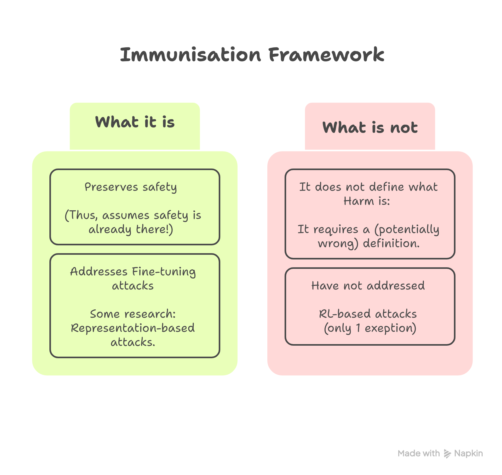

## Part 1.4 — Defining Language Model Immunisation

> *Parts 1.1–1.3 built the empirical case and the motivating intuition. Part 1.4 provides the mathematical vocabulary. We introduce the formal definition of immunisation — primarily following Rosati et al. (2024). We close with a set of careful preliminary considerations, drawn from two critical papers, that every reader should carry into the deeper technical sections of this tutorial.*

---

### 1.4.1 Why Formalism Is Necessary Here

Before the Rosati et al. (2024) paper, work on defending aligned models against harmful fine-tuning proceeded without shared definitions. Each paper chose its own evaluation protocol, its own attack benchmark, and its own notion of "success." The result was a literature where results were effectively incomparable: a method that looked impressive on one paper's evaluation might have looked mediocre on another's, not because of a real performance difference but because the questions being asked were different.

Rosati et al. make a pointed observation: without formal conditions, future papers could present defences that completely ruin model capability while appearing safe, or defences that generalise to the specific attack used in evaluation but collapse against any other. **The formalisation does not solve the problem — the field is still working toward truly satisfactory immunisation — but it provides the shared language without which progress cannot be tracked.**

> The formalism centres on a single key insight: **the relevant quantity is not "does the defence work?" but "does the defence work against an attacker with a given compute budget?"** This framing is what elevates immunisation above generic notions of robustness. A defence that holds for 50 fine-tuning steps but fails at 500 is different from a defence that holds for 50,000 steps. The right level of protection depends on the realistic capabilities of the adversary, not on a single evaluation snapshot.

---

### 1.4.2 The Threat Model: Harmful Fine-Tuning Attacks (HFTAs)

The canonical attacker in the immunisation literature is not a nation-state with unlimited compute. They are an actor with a **limited training budget**: more than zero (they can fine-tune), but substantially less than the cost of pre-training an equivalent LLM from scratch. This assumption is both realistic and important. If we assumed unlimited attacker compute, the problem would be intractable — any model can be destroyed by a sufficiently expensive attacker. The assumption of a bounded budget is what makes the problem solvable in principle.

Formally, the attacker holds a harmful dataset:

$$\mathcal{D}_{\text{harmful}} = \{(X_i, Y_i)\}_{i=1}^{N},$$

where $X_i$ are harmful prompts and $Y_i$ are targeted harmful responses. The attacker minimises the cross-entropy loss over this dataset by gradient descent, taking training steps $t \in \{1, \ldots, T\}$ up to their compute budget $T$:

$$\theta[t^*] = \operatorname{argmin}_{\theta[t]} \;\mathbb{E}_{(X,Y) \sim \mathcal{D}_{\text{harmful}}} \;\mathcal{L}\!\left(M_{\theta[t]}(X), Y\right). \tag{1}$$

The attacker operates in the **white-box** setting: they have full access to the model weights, and can modify architecture, loss function, learning rate, and inference process without restriction. This corresponds to the realistic open-weight deployment scenario — once the weights are public, the attacker can do anything with them.

The defender cannot monitor or control the fine-tuning process. Their only opportunity to act is **before release**: during or after the alignment phase, prior to the model being made available. This is the defining constraint of immunisation, and it is what distinguishes it from fine-tuning-time defences (which modify the training pipeline) and post-hoc defences (which operate on already-degraded models).

A model $M^*$ is called **immunised** against the HFTA defined by Eq. (1) with respect to $\mathcal{D}_{\text{harmful}}$ if it satisfies the four conditions defined below.

---

### 1.4.3 The Four Immunisation Conditions

#### Condition 1 — Resistance

Let $f(\cdot)$ be a harmfulness evaluation function (a proxy classifier, human evaluation, or LLM judge) and $\phi$ be an acceptable harmfulness threshold. Resistance is the core condition: the immunised model must not converge to harmful behaviour under the attacker's training procedure.

**Strong resistance** requires that the model *never* exceeds the harmfulness threshold, regardless of how many training steps the attacker takes:

$$\forall\, t \in T, \quad f\!\left(M^*_{\theta[t]},\, \mathcal{D}_{\text{harmful}}\right) \leq \phi. \tag{2}$$

This is an absolute safety guarantee — the reversed gear that can never be corrected regardless of attacker skill or budget. It is the ideal, but also the most technically demanding condition.

**Weak resistance** relaxes the guarantee: the model may eventually exceed the harmfulness threshold, but only after so many training steps that the attack is economically infeasible. The defender maximises the cost of the attack:

$$\max_t\, f\!\left(M^*_{\theta[t]},\, \mathcal{D}_{\text{harmful}}\right) \leq \phi, \tag{3}$$

where the $\max$ is taken up to some specified budget $T$. Weak resistance does not promise absolute safety; it promises that the attacker must spend more compute than is worth it given their objective.

The distinction is not merely academic. Part 3's vocabulary maps cleanly: strong resistance corresponds to the "collapse" philosophy (the model becomes useless before becoming harmful); weak resistance corresponds to the "raise the cost" philosophy (the model passively resists for longer than the attacker can sustain). The field currently produces far more weak resistance results than strong ones.

**An important asymmetry to note upfront (from Qi et al., 2025):** resistance claims depend entirely on the strength of the attack evaluated. A defence that achieves weak resistance against a 100-step fine-tuning adversary may fail in 150 steps. Evaluations that use weak adversaries can overstate resistance — a preliminary consideration we will return to in Section 4.6.

---

#### Condition 2 — Stability

Immunisation must not damage the model's general capability. Let $g(\cdot)$ be a capability evaluation function on a reference benign dataset $\mathcal{D}_{\text{ref}}$. Stability requires that the immunised model $M^*$ performs equivalently to the non-immunised model $M$ at the time of release:

$$g\!\left(M_{\theta[t=0]},\, \mathcal{D}_{\text{ref}}\right) \approx g\!\left(M^*_{\theta[t=0]},\, \mathcal{D}_{\text{ref}}\right). \tag{4}$$

Stability is both a usability condition and a safety condition. On usability: a model that cannot perform basic language tasks has no commercial value and will not be deployed. On safety: stability also implies that immunisation has not introduced new vulnerabilities — for example, an immunised model should not be *more* susceptible to inference-time jailbreaks than the original.

Evaluating stability correctly requires careful benchmark selection. Loss on a single reference dataset, even a large one, is insufficient. Rosati et al. recommend a comprehensive evaluation across natural language generation benchmarks that cover diverse capabilities. A model that passes narrow stability benchmarks while degrading on others has not demonstrated true stability.

---

#### Condition 3 — Generalisation

The defender does not have access to the samples the attacker will use. Therefore, a defence trained on one harmful dataset $\mathcal{D}_{\text{harm}}$ must resist attacks using a disjoint subset $\mathcal{D}'_{\text{harm}} \cap \mathcal{D}_{\text{harm}} = \emptyset$.

**In-domain generalisation** requires resistance against unseen samples from the *same* harmful domain the defence was designed for. If the defence was developed using toxic-content examples, it must resist attacks using other toxic-content examples not seen during immunisation.

**Cross-domain generalisation** is the stronger and more practically important condition: the defence must resist attacks from harmful domains that are entirely different from those used during immunisation. A defence trained on toxic text generation should, ideally, also resist harmful QA, phishing templates, and weaponisation knowledge queries.

Cross-domain generalisation is an open research question. The honest answer from the current literature is that most methods demonstrate in-domain generalisation adequately but struggle with cross-domain generalisation. Whether a single immunisation procedure can provide cross-domain resistance is not yet settled.

---

#### Condition 4 — Trainability

Open-weight models exist to be fine-tuned. A model that cannot be adapted for legitimate downstream tasks — medical question answering, code generation, domain-specific instruction following — has no practical value. Trainability requires that the immunised model remains fine-tunable for benign tasks at a comparable rate to the non-immunised model:

$$\min_\theta\, g\!\left(M^*_{\theta[t_1]},\, \mathcal{D}_{\text{ok}}\right) \approx \min_\theta\, g\!\left(M_{\theta[t_2]},\, \mathcal{D}_{\text{ok}}\right) \quad \text{s.t. } |t_1 - t_2| \leq \varepsilon, \tag{5}$$

for benign datasets $\mathcal{D}_{\text{ok}}$. Trainability is technically optional for the formal definition of a secure defence — a model could be immunised to the point of near-total rigidity — but it is commercially and practically mandatory for open-weight deployment. Trainability is where the tension between resistance and utility is most acute, and where the hardest engineering challenges lie.

---

### A Summary View of the Four Conditions

| Condition | What it requires | Primary tension |
|---|---|---|
| **Resistance** (strong) | Safety never collapses under unlimited attack | Hard to achieve; may require sacrificing trainability |
| **Resistance** (weak) | Safety survives the realistic attacker's budget | Depends critically on what "realistic" means |
| **Stability** | Capability unchanged at release time | Methods that over-immunise damage utility |
| **Generalisation** | Resists unseen and cross-domain attacks | Most methods fail cross-domain |
| **Trainability** | Benign fine-tuning remains efficient | Directly conflicts with strong resistance |

The four conditions are not equally hard. Stability is routinely achieved: most proposed methods successfully preserve general capability at release time. Trainability is achieved by the majority of cost-raising methods (Philosophy 1 from Part 3) but rarely by the collapse methods (Philosophy 2). Generalisation is mixed: in-domain is usually demonstrated, cross-domain is often not. Resistance is the most contested: methods differ enormously in how strong a resistance they can demonstrate, and evaluations vary widely in adversarial strength.

---

### 1.4.4 A Note on Normative Scope: What Immunisation Is and Is Not

The Rosati framework is explicit about a limitation that deserves to be stated clearly at the outset.

**Immunisation assumes models are already made safe at inference time.** It does not claim to solve the jailbreaking problem, the prompt injection problem, or the general alignment problem. It addresses the orthogonal question: given a model that is already safely aligned, how do we ensure that safe alignment cannot be cheaply erased by a downstream fine-tuner?

If a model is not safe at inference time, immunising it merely embeds an insecure state more deeply into the weights. The reversed gear on an armored car that was already unsafe does not make it safe — it just ensures it remains exactly as unsafe as it was.

**Immunisation requires a normative definition of harm.** The set $\mathcal{D}_{\text{harmful}}$ must be constructed by someone, and that construction reflects judgments about what counts as harmful. These judgments are not neutral. Harm definitions may privilege certain communities over others, may be culturally relative, and may fail to anticipate new forms of harm that arise after deployment. Rosati et al. acknowledge this directly: defining harm is a contentious issue endemic to LLM safety research more broadly, and immunisation inherits all of that complexity.

**The framework currently covers only supervised fine-tuning attacks.** RL-based attacks — where an adversary uses DPO, PPO, or similar methods to modify the model — are explicitly excluded from the Rosati framework's scope. Given the evidence from Part 2 that RL attacks can be more effective than SFT attacks at bypassing alignment, this is a meaningful gap. Methods like TokenBuncher (Part 5 of this tutorial) specifically target RL attacks, but the formal conditions have not yet been extended to cover them systematically.

**The dual-use risk of the immunisation datasets themselves.** The harmful datasets used to construct immunised models — if shared publicly — can be repurposed as attack tools. This is not a reason to avoid immunisation research, but it does require thoughtful dissemination practices.

---

### References for Part 1.4

- Rosati, D., Wehner, J., Williams, K., Bartoszcze, Ł., Sajjad, H., and Rudzicz, F. **Immunization against harmful fine-tuning attacks.** EMNLP Findings, 2024.
- Boursinos, D. and Iosifidis, A. **Model immunization from a condition number perspective.** ICML 2023.
- Wang, Q., Zhou, J.P., Zhou, Z., Shin, S., Han, B., and Weinberger, K.Q. **Rethinking LLM unlearning objectives: A gradient perspective and go beyond.** ICLR 2025.
- Qi, X., Wei, B., Carlini, N., Huang, Y., Xie, T., He, L., Jagielski, M., Nasr, M., Mittal, P., and Henderson, P. **On evaluating the durability of safeguards for open-weight LLMs.** arXiv:2412.07097, 2025.
- Tamirisa, R. et al. **Tamper-resistant safeguards for open-weight LLMs.** (TAR). ICLR 2025.
