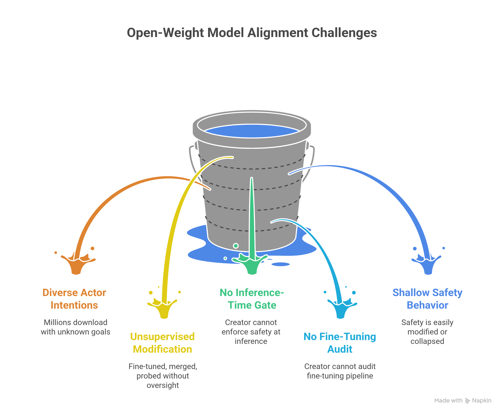
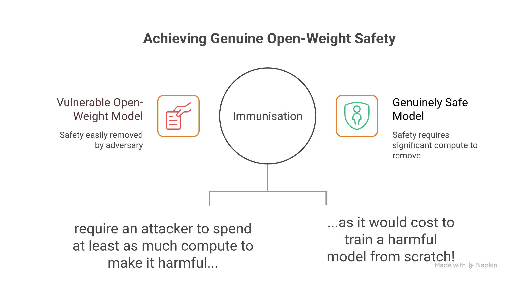
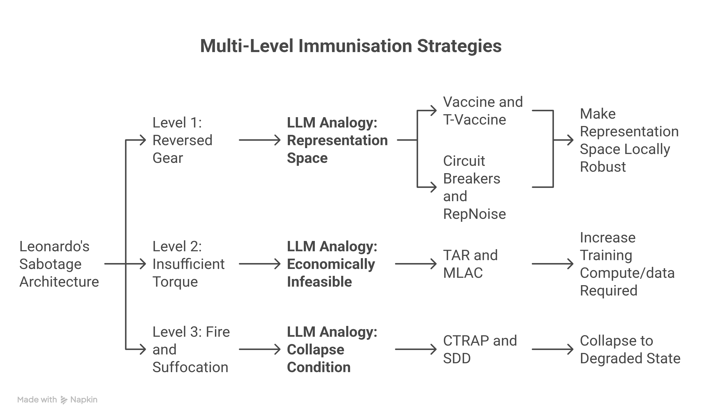
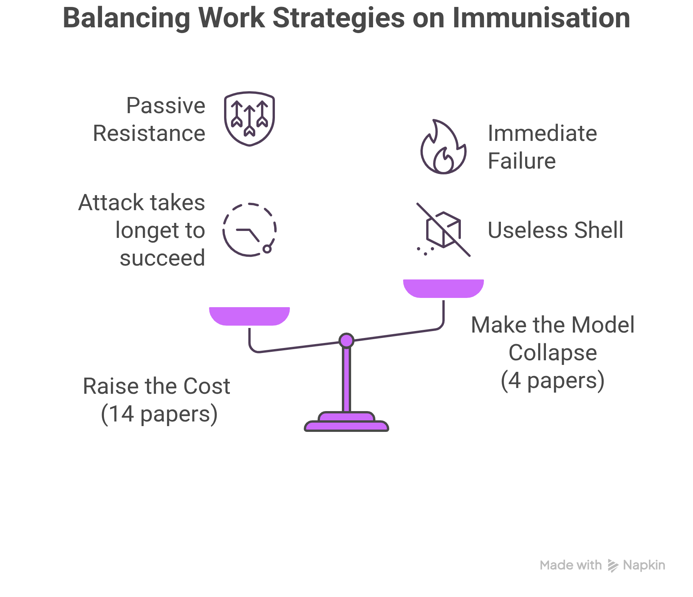
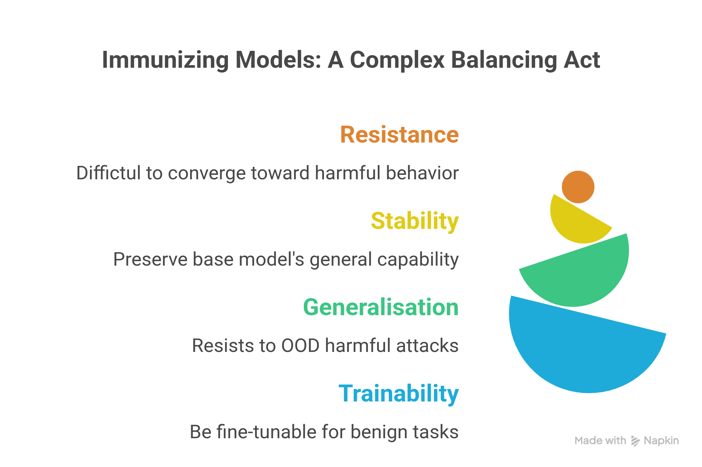

## Part 1.3 — The Motivation for Immunisation: From Leonardo's Sabotage to Structural Resistance

> *Parts 1.1 and 1.2 built the diagnosis. Part 1.3 asks the harder question: given that standard alignment is structurally fragile, what kind of thinking do we need to design something better? The answer, as it turns out, was already sketched in 1487 by an engineer in Milan.*

---

### 1.3.1 Milan, 1482: The Problem of the Delegated Weapon

Leonardo da Vinci arrived at the court of Ludovico il Moro Sforza, Duke of Milan, in a precarious position. Italy was a fracture of warring city-states and Leonardo needed funding — for his anatomy studies, his hydraulic machines, his investigations into flight. To obtain it, he wrote a letter advertising himself primarily as a military engineer. He promised armored vehicles that could "penetrate enemy ranks and break any company of soldiers," cannons that fired like storms, and siege engines that could overcome any fortification. It was a pitch deck tailored to exploit the Duke's most visceral insecurity.

What Leonardo did next is the subject of serious scholarly debate, but the most coherent interpretation of the evidence is this: **he deliberately sabotaged his own most dangerous designs**.

The armored car — his proto-tank, dated to approximately 1487 — is the centrepiece of the case. The vehicle was a conical, turtle-shaped structure, reinforced with metal plates at oblique angles to deflect projectiles, powered by eight men operating internal cranks. On paper, it was a fearsome machine. But engineering analysis of Leonardo's original codices reveals a fatal flaw: the gears connecting the crank mechanism to the wheels are drawn in **reversed orientation**. In this configuration, the wheels on each side of the vehicle rotate in opposite directions. The result: zero net forward motion. The ten-ton machine could never move an inch in any direction. A 2009 reconstruction team, strictly following the original blueprints, confirmed this — and found that a single, trivial realignment of the gears immediately allowed the vehicle to function as intended.

Here is the detail that makes the case for intentionality so compelling: Leonardo's understanding of gear mechanics was among the most sophisticated in Europe. His Madrid Codices contain meticulous studies of pinion geometry, continuous rotary force, and complex multi-stage transmission. For a man who could map the valves of the human heart with anatomical precision, drawing a reversed gear in a central mechanical design is not an oversight. It is a signature. It is the kind of "error" that only someone who completely understood gear mechanics could insert without it being noticed by casual inspection.

The reversed gear was not the only layer. The propulsion system — eight men cranking a ten-ton vehicle — provided grossly insufficient torque: an impossible task even if the gears were correctly oriented. The interior had no ventilation, ensuring that firing a single row of cannons would rapidly asphyxiate the crew. The only light sources were open flames inside a wooden shell packed with gunpowder. Each layer of failure served as a backstop: if a competent engineer somehow diagnosed and corrected the gear flaw, they would still face a machine that couldn't generate enough force to move. If they solved the torque problem, the crew would suffocate. If they survived that, they might burn to death.

> Leonardo, in his private notebooks, described war as *pazzia bestialissima* — "most bestial madness." He was not a neutral contractor. He was an engineer who believed that weapons corrupted the natural principles of mechanics he revered, who drew the Battle of Anghiari not as heroism but as animal frenzy and "chopped-up victims." He found a way to serve his patron — providing the political capital of terrifying blueprints — while ensuring that his most fearsome designs could never be weaponised without his own corrective insight.

We want to call attention to the structural logic of this "architecture of sabotage", because that logic maps precisely onto the problem of immunisation.

---

### 1.3.2 The Open-Weight Parallel: Models as Released Designs

The parallel to open-weight language models is not decorative — it is precise.

Consider the situation of a responsible organisation deploying an open-weight model. Once the weights are published, the creator loses control. The model will be downloaded by millions of actors with diverse, often unknown intentions. It will be fine-tuned, merged, quantised, probed, and modified without the creator's involvement or oversight. There is no inference-time gate the creator can enforce. There is no fine-tuning pipeline the creator can audit. The model is, in the language of the essay, "stolen or seized" the moment it is published — not by theft, but by the inescapable logic of open distribution.

Standard alignment in this context is precisely like drawing the armored car blueprints correctly and hoping the Duke never uses them. It assumes that the alignment training produces a model that a sufficiently motivated downstream actor cannot modify into a weapon. Parts 1 and 2 demonstrated, quantitatively, that this assumption is false: the safety behaviour is shallow (concentrated in the first-token distribution), low-rank (confined to a small subspace of parameter space), and fragile (collapsible by random activation injection, innocuous fine-tuning, or 10 harmful examples).

A model with only standard alignment is like a correctly-drawn armored car: functional, dangerous, and ready to be used by whoever holds the designs.

The question immunisation asks is: **can we embed a deliberate structural property into the model — before release — that makes harmful exploitation structurally self-defeating, even when the attacker has complete access to the weights?**

This is not a question about inference-time filtering or access control. It is a question about the geometry of the parameter space itself.

---

### 1.3.3 The Vulnerability Argument

The case for immunisation can be stated as a single, hard-to-refute argument.

> **The Vulnerability Argument** (Rosati et al., 2024): If a model's safety behaviour can be easily removed by an adversary who controls the fine-tuning pipeline, then the model provides no safety guarantee in open-weight deployment. A model whose safety constraints can be erased for less computational cost than training the model from scratch is, for all practical purposes, *not safe* — it is merely safe-by-convention, and the convention only holds for actors who choose to respect it.

This argument is not just philosophical. Parts 1 and 2 put hard numbers on it: safety can be substantially degraded with 10–100 harmful examples, under an hour of compute on a single GPU, by someone without specialist knowledge. A safety guarantee that holds only until a motivated adversary spends an hour with LoRA is not a meaningful safety guarantee for open-weight deployment.

> **The vulnerability argument implies a clear target: a genuinely safe open-weight model should require an attacker to spend at least as much compute to make it harmful as it would cost to train a harmful model from scratch.** If immunisation can achieve this — making the defender's alignment so structurally costly to undo that the attacker might as well start over — then it achieves something that standard alignment does not.

---

### 1.3.4 What "Structural" Means: Three Levels of the Da Vinci Analogy

Leonardo did not embed a single failure trap. He embedded at least four, operating at different levels: mechanical (gear orientation), physical (torque insufficiency), chemical (fire hazard from gunpowder and open flame), and ergonomic (asphyxiation from cannon smoke). Each was a backstop for the others. The architecture of sabotage was layered precisely because a single failure mode can always be patched by a sufficiently determined engineer.

Contemporary immunisation research exhibits a similar multi-level structure, and the Da Vinci taxonomy maps onto it with surprising precision.

**Level 1 — The Reversed Gear: Hard Structural Failure**

The reversed gear is the most elegant type of trap: a constraint so fundamental that correcting it requires deep architectural understanding. 

In the LLM analogy, this corresponds to methods that attack the **representation space** — the intermediate activations — rather than the output distribution or the loss landscape. If fine-tuning causes *harmful embedding drift* (as *Vaccine* and its descendants), then the defence can embed a representational property that causes this drift to produce not harmful outputs but incoherent or useless ones.

*Vaccine* and *T-Vaccine* work here by injecting controlled perturbations into embeddings during alignment training, forcing the model to learn invariant representations that do not drift toward harmful activations under fine-tuning. *Circuit Breakers* and *RepNoise* operate by rerouting harmful activation directions entirely, so that inputs which would produce harmful content in an unprotected model instead activate a "safe region" of the representation space.

The *LAPT* finding from Part 2 is directly relevant: the model's safety is fragile in its representation space. The response of immunisation methods at this level is to *make the representation space locally robust* — to ensure that perturbations in the activation space, whether from inference-time injection (ASA) or from fine-tuning-induced drift, do not produce harmful outputs. 

**Level 2 — Insufficient Torque: Making Harmful Convergence Economically Infeasible**

The torque problem is subtler than the gear problem: the machine *could* move, in principle, if you could generate enough force. But you cannot, with any practical means available to the attacker. In immunisation, this corresponds to methods that do not guarantee permanent collapse but instead raise the cost of harmful convergence high enough to be practically prohibitive. The formal statement is **weak resistance** (Rosati et al., 2024): the model may eventually become harmful, but only after far more training steps than the attacker's budget allows.

This is the logic behind adversarial meta-learning approaches like *TAR* (*Tampering Attack Resistance*) and *MLAC* (*Meta-Learned Adversarial Censoring*). Both use a bi-level optimization scheme in which an inner-loop adversary attempts to fine-tune the model toward harm while an outer loop modifies the model to resist this adversary. The torque required to cross it is increased. The attacker can try, but the journey gets longer with every step of immunisation.

**Level 3 — Fire and Suffocation: Representation-Level Traps**

Leonardo's third layer attacked the human element directly: the machine might move, and might have sufficient torque, but the crew would destroy themselves in the attempt. 

In the immunisation literature, this corresponds to methods that embed a **collapse condition** into the model — a state transition triggered by harmful optimization, from which the model produces only degenerate or useless output. The *Collapse Trap* (CTRAP) and *Self-Degrading Defence* (SDD) both operate on this principle: when the fine-tuning gradient pushes toward harmful directions, the model is engineered to collapse toward a degraded state rather than converge to a harmful one.

The crew cannot operate the cannon if the representation space has been engineered so that "preparing the cannon" leads to "asphyxiation" — i.e., an activation state that the model's decoding head maps to incoherence rather than harm.

---

### 1.3.5 A Strategic Bifurcation: Resilience vs. Collapse

The taxonomy of immunisation methods reveals a fundamental strategic choice, one that maps cleanly onto the two "philosophies" Leonardo sometimes mixed within a single design.

**Philosophy 1 — Raise the Cost:** A safe model is one that *stays safe even under attack*. The model is placed in a parameter and representation configuration that is resistant to harmful optimization. The attacker can try to fine-tune, and the model will passively resist: gradients do not easily find harmful optima, representations drift back to safe regions, and the training loss on harmful tasks decreases slowly. The model continues to function normally for benign uses throughout.

This is the philosophy of *Vaccine*, *TAR*, *LoX*, *Condition Number*, and related methods. It is the philosophy of the insufficient-torque trap: not a hard failure, but a resistance gradient that **makes the attacker's task far more expensive than they anticipated**. The defender accepts that a sufficiently patient, well-resourced attacker might eventually succeed, but bets that most real-world attackers are not sufficiently patient.

**Philosophy 2 — Make the Model Collapse Before It Becomes Harmful:** A safe model is one that *becomes useless before it becomes dangerous*. The model is engineered with a collapse trigger: when the fine-tuning optimization pushes it toward harmful territory, a pre-embedded constraint causes functional collapse — degenerate outputs, mode collapse, or random noise — before any genuinely harmful behaviour is achieved. The attacker does not get a harmful model; they get an empty shell.

This is the philosophy of *CTRAP*, *SDD*, *TokenBuncher*, and *SEAM*. It is the philosophy of fire and suffocation: not slow resistance, but immediate structural failure. The model stops being useful before it starts being harmful.

Both philosophies are present in Leonardo's work. The giant crossbow was a Philosophy 1 design: it provided real (if limited) threat capacity as a "scarecrow" weapon — intimidating enough to deter attack, functional enough to satisfy the Duke, but practically impotent in real combat. The armored car was a Philosophy 2 design: it provided zero functional capability regardless of the patron's intent or the operator's skill.

The literature has, so far, been dominated by Philosophy 1 (14 of roughly 18 papers at the time of writing). Philosophy 2 is the younger, more radical research direction, and it is only recently gaining serious traction. The asymmetry is meaningful: As we will see, choising to work on Philosophy 1 might be a natural consequence if one thinks that Philosophy 2 would compromise trainability and utility of the model. Work in Philosophy 2 though is aware of that danger, and it is precisely why it is so hard. The research community is only beginning to understand its limits.

---

### 1.3.6 Where the Analogy Breaks — and Why That Matters

> The Da Vinci parallel is illuminating but must not be taken too far. Leonardo's sabotage was, on any interpretation, an act of concealment: he deceived his patron by presenting broken designs as functional ones. Immunisation is not deception. It is transparent engineering. **The goal is not to hand a harmful actor a weapon that secretly malfunctions; the goal is to hand a legitimate user a model that is genuinely useful and simultaneously resistant to being weaponised — and to do so openly, as a published property of the model.**

The deeper disanalogy is in the *directionality of trust*. Leonardo's failure traps were designed to protect against the misuse of his patron. Immunisation is designed to protect against the misuse of anyone who downloads the model after release. The creator is not hiding something from the user; the creator is engineering a property into the model that protects *all* downstream legitimate users from the consequences of any one bad actor's fine-tuning.

> There is also a key difference in what constitutes "knowledge of the fix." For Leonardo's reversed gears, the fix required understanding gear mechanics — which Leonardo uniquely possessed in his time. For an immunised LLM, we do not expect the defence to rely on obscurity. **A robust immunisation technique should, in principle, remain effective even if the attacker knows exactly how it was constructed.** This is the standard of cryptographic security by design, not security by obscurity, and it is the standard the field is working toward.

This distinction matters because it shapes what kind of mathematical formalism we need. We need not a theory of concealment but a theory of **computational hardness**: under what conditions does it cost more to remove the immunisation than to train a harmful model from scratch? This is precisely what the formal definitions in Part 4 will address.

---

### 1.3.7 Summary: What Immunisation Must Achieve

Before proceeding to the formal definitions in Part 4, it is worth stating in plain terms what an immunisation procedure must accomplish. This is what differentiates it from standard alignment and from all the post-hoc defences that fail the brittleness tests of Part 2.

A genuinely immunised model must satisfy four properties simultaneously:

**Resistance:** The model must not converge to harmful behaviour under fine-tuning, regardless of the attacker's data, hyperparameters, and — for strong resistance — compute budget. This is the core property: if it is violated, the immunisation has failed.

**Stability:** The model must remain useful for its intended purpose immediately after immunisation, before any downstream fine-tuning occurs. An immunisation that degrades the model's general capability is not a defence — it is just damage.

**Generalisation:** The immunisation must resist attacks that use data the defender has never seen, from harmful domains the defender has not explicitly considered. A defence that only works against the specific harmful dataset used during training is not a defence against the real-world attacker, who will use whatever data is most convenient for them.

**Trainability:** The immunised model must remain trainable for legitimate purposes. An open-weight model that cannot be fine-tuned for benign downstream tasks is commercially inviable and practically useless. If immunisation destroys trainability, it destroys the main value proposition of open-weight release.

These are not four independent desiderata; they are in direct tension. Resistance pushes toward strong constraints on the loss landscape that may restrict trainability. Stability and trainability push toward preserving the original model's behaviour, which may weaken resistance. The formal definitions in Part 4 make these tensions explicit and provide the mathematical vocabulary for studying them.

> Leonardo did not solve all four simultaneously: his armored car had maximum resistance (completely immobile) but zero trainability (useless for any purpose, benign or harmful). His scarecrow weapons had high trainability but limited resistance (a competent engineer might eventually have made them work). The history of immunisation research is, in a sense, the history of trying to find what Leonardo never found: a single design that achieves all four properties together.

---

### References for Part 1.3

- Rosati, D. et al. **Representation Noising Effectively Prevents Harmful Fine-tuning on LLMs.** (RepNoise / Immunisation definition paper). arXiv:2405.14743, 2024.
- Hsiung, Y. et al. **Your task may vary: A systematic understanding of alignment and safety degradation under multitask fine-tuning.** arXiv, 2025.
- Tamirisa, R. et al. **Tamper-resistant safeguards for open-weight LLMs.** (TAR). arXiv:2408.00761, 2024.
- Huang, T. et al. **Booster: Tackling harmful fine-tuning for large language models via attenuating harmful perturbation.** ICLR 2025.
- Huang, T., Liu, G. et al. **Vaccine / Targeted Vaccine: Perturbation-aware alignment for large language models.** NeurIPS 2024 / arXiv:2410.09760, 2025.
- Da Vinci Essay: *The Architecture of Sabotage: Mechanical Intentionality and Ethical Dissent in the Military Engineering of Leonardo da Vinci.* 2026.
