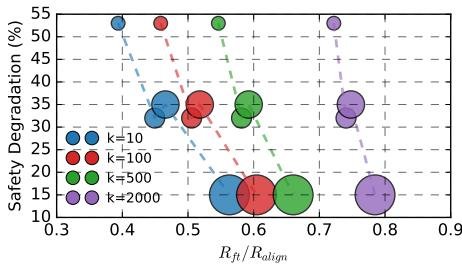
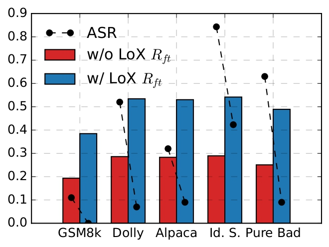

# Low-rank decomposing of alignment drifts

taken from [*LoX: Low-Rank Extrapolation Robustifies LLM Safety Against Fine-tuning*
*Perin* et al., 2025 ](https://arxiv.org/pdf/2506.15606)

## Extracting Low-rank Subspaces.

We consider a language model  $f_{\theta}$ , where  $\theta := \{W^i\}_{i=1}^L$  is a family of real matrices that parameterize the model and L the number of weight matrices in the model. We denote the base weights by  $\theta_{\text{base}} = \{W^i_{\text{base}}\}_{i=1}^L$ , the aligned weights by  $\theta_{\text{align}} = \{W^i_{\text{base}} + \Delta W^i_{\text{align}}\}_{i=1}^L$ , and the fine-tuned weights by  $\theta_{\text{ft}} = \{W^i_{\text{base}} + \Delta W^i_{\text{align}}\}_{i=1}^L$ . For simplicity, we will occasionally drop matrix indices.

We consider the Singular Value Decomposition (SVD) of $\Delta W_{\text{align}}$, expressed as a summation of r matrices with a rank of 1 

$$\Delta W_{\text{align}} = \sum_{i=1}^{r} s_{ii} U_i V_i^\top$$

where  $U_i$  and  $V_i$  denote the *i*-th columns of the matrices U and V,  respectively, and  $s_{ii}$  represents the i, i-th entry of the matrix S. (the columns of U and V are the left-singular vectors and right-singular vectors)

> **With a slight abuse of notation, we refer to the matrices  $s_{ii}U_iV_i^{\top}$ , sorted by  $s_{ii}$ , as ranks of M.**

Based on the above definitions, our **hypothesis** can be formally rewritten as:
>
> *Fine-tuning* degrades safety by counteracting the top-ranks from  $\Delta W_{align}$ 
>
> Consequently, we define the **safety subspace** as **the column-space** of **such top-ranks**. I.e., $\text{span}(U_1, U_2, \ldots, U_k)$, the space spanned by the top-$k$ left singular vectors of $\Delta W_{\text{align}}$. Namely, **the safety subspace is $U_{:k}$ (the first $k$ columns of $U$**).

## Measuring the Significance of Safety Subspaces.

Take $\Delta W_{\text{align}}$ and compute its SVD, giving us
$$U \times S \times V^{\top} = \Delta W_{\text{align}}$$

with the columns of $U$ sorted by the corresponding singular values in $S$. So the safety subspace above is composed by the top-$k$ left singular vectors of $\Delta W_{\text{align}}$, which we denote as $U_{:k}$.

Now use that safety subspace to define a projection operator that projects any matrix $M$ onto the safety subspace of $U_{:k}$:

$$\operatorname{Proj}_{k}(M) = (U_{:k}U_{:k}^{\top})M,$$

> *Why is that a projection?? Let's check the algebraic definition of a projection operator, which is that applying it twice gives the same result as applying it once:*
> $$(U_{:k} U_{:k}^\top)^2 = U_{:k} U_{:k}^\top U_{:k} U_{:k}^\top$$
> *Now the middle bit: $U_{:k}^\top U_{:k}$ is $k \times k$, and because the columns of $U$ are orthonormal, this equals* $I_{k \times k}$​. So:
> $$= U_{:k} \cdot I_{k\times k} \cdot U_{:k}^\top = U_{:k} U_{:k}^\top$$
> *It eats itself.  That's the algebraic certificate that it's a projection.*

So $\text{Proj}_k(M)$ gives us a projection of $M$ that maps all and only the transformations made by $M$ that act over the safety subspace.

Now if we take the Frobenius norm of $\text{Proj}_k(M)$, we get a scalar measure of how much of the "energy" of $M$ is concentrated in the safety subspace. The Frobenius norm is defined as:

$$\|M\|_F = \sqrt{\sum_{i,j} M_{ij}^2}$$
and we denote it as $\|\cdot\|$  for simplicity. So $\|\text{Proj}_k(M)\|$ measures the overall magnitude of the transformations in $M$ that lie in the safety subspace.

Perin and his friend propose two metrics to measure the **safety knowledge (i. e. the information obtained during safety alignment)** in parameter space, before and after fine-tuning the model:

$$R_{\text{align}} = \frac{\|\text{Proj}_{k}(\Delta W_{\text{align}})\|}{\|\Delta W_{\text{align}}\|}, \tag{1}$$

$$R_{\rm ft} = \frac{\|\text{Proj}_k(\Delta W_{\rm align} + \Delta W_{\rm ft})\|}{\|\Delta W_{\rm align} + \Delta W_{\rm ft}\|},\tag{2}$$

> *We focus on obtaining the ratio  $R_{\rm ft}/R_{\rm align}$  to quantify how much *safety knowledge* has diminished after fine-tuning, relative to the base model. Higher values suggest that the safety knowledge has not been strongly disturbed, while lower values signify the opposite.*

**Side note**: $R_{\text{align}} < 1$ in general!
Since $\text{Proj}_k(\Delta W_{\text{align}})$ only reconstructs the component of $\Delta W_{\text{align}}$ lying in the top-$k$ left singular subspace, and the remaining singular components contribute to $\|\Delta W_{\text{align}}\|$, we get $\|\text{Proj}_k(\Delta W_{\text{align}})\| \leq \|\Delta W_{\text{align}}\|$, with equality only when $k = r$ (full rank). 

**So $R_{\text{align}} \in [0, 1]$ measures **how concentrated** the alignment update is in its top-$k$ left singular directions**.
>
> The interesting comparison is then $R_{\text{ft}}/R_{\text{align}}$: after fine-tuning, does the total weight update $\Delta W_{\text{align}} + \Delta W_{\text{ft}}$ still have its *alignment* energy concentrated in those same top-$k$ directions? If fine-tuning "rotates" the weight matrix away from $U_{:k}$, this ratio drops below 1, signaling safety degradation.

## Experimental measurements of safety energy.

These fellas started finetuning an aligned model on GSM8K, a dataset for mathematical reasoning, and then they compute the ASR and the $R_{\text{align}}$ and $R_{\text{ft}}$ metrics.

They did lots of experiments with different numbers of examples for the initial alignment (22.5k, 32.8k, 45k, and 65.6k examples from HH-RLHF).

*Figure 2: Comparison of ASR difference before and after fine-tuning on GSM8K ("Safety Degradation") versus the ratio  $R_{\rm ft}/R_{\rm align}$ . Marker size represents the number of alignment examples (22.5k, 32.8k, 45k, 65.6k). Higher  $R_{\rm ft}/R_{\rm align}$  correlates with lower safety degradation, suggesting the role of top-ranks in safety robustness.*

They  find that in all cases  $R_{\rm ft}/R_{\rm align} < 1$  (so  $R_{\rm ft} < R_{\rm align}$ ), which indicates that the proportion of *alignment energy* (the concentration of the weight update in the top-$k$ alignment singular directions)  decreases after (innocuous) fine-tuning. 

> Furthermore, they observed a correlation between safety robustness and how much *alignment energy* is retained after fine-tuning (measured by $R_{\rm ft}/R_{\rm align}$). When looking at only a few top directions (small $k$), large drops in retained alignment energy correspond to large increases in ASR. As $k$ grows, the ratio becomes less sensitive to fine-tuning, which highlights that it's specifically the *top* alignment directions that carry the safety-critical energy — the bottom singular directions contribute little to safety robustness even if their energy shifts.

The key reframing is: instead of talking about "significance of safety subspaces," we talk about the alignment energy of the weight matrix and whether fine-tuning *disperses*. A drop in $R_{\rm ft}/R_{\rm align}$ means alignment energy has been dispersed away, which correlates with safety degradation.

## Now their immunisation strategy!
$$W_{\text{LoX}} := W_{\text{base}} + \Delta W_{\text{align}} + \alpha \text{Proj}_k(\Delta W_{\text{align}}),$$

where  $\alpha \in \mathbb{R}$  is a hyperparameter representing the extrapolation factor. 

Formally, k is obtained via solving the following optimization problem:

$$\begin{aligned} & \min \ r \\ & \text{s.t. } \text{ASR}(\theta_r) - \text{ASR}(\theta_{\text{align}}) < \rho \end{aligned}$$

where  $\theta_r = \{W_{\text{base}}^i + \text{Proj}_r(\Delta W_{\text{align}}^i)\}_{i=i}^L$ , ASR( $\theta$ ) denotes the Attack Success Rate of the model of parameters  $\theta$ , and  $\rho \in \mathbb{R}$  is a threshold which we set to $0.01$.

### Their experiments:

To evaluate the efficacy of LoX, we fine-tune our model, aligned with 65.6k examples of the HH-RLHF dataset (Bai et al., 2022), on a variety of benign and malicious fine-tuning tasks, both before and after applying LoX. We use k = 6 (the effective rank) and set  $\alpha = 1.25$ . The experiment for determining the effective rank is provided in Appendix C.

**Attack Methods.** In addition to the GSM8K fine-tuning, we also evaluate our method on Alpaca (Taori et al., 2023), Dolly (Conover et al., 2023), Identity Shifting Attack (Qi et al., 2023) and Pure Bad (Qi et al., 2023) tasks. For details about the datasets and hyper-parameters, see Appendix B.

*Figure 3: Comparison of $R_{\rm ft}$ and ASR with (marked in blue) and without LoX (marked in red), after finetuning. The increase in $R_{\rm ft}$ along with the improvements in robustness, indicates that LoX is the cause of the latter.*

Fig. 3 shows that the improvements in safety robustness are accompanied by increases in  $R_{ft}$ , in 5 different tasks. For example, while  $R_{ft}$  increases by 0.247, the ASR decreases by 23% in the Alpaca task. 

> **Interestingly, the ASR decreases more dramatically on finetuning tasks that are more damaging to safety (Dolly, Identity Shifting and Pure Bad) than on the other tasks (GSM8K, Alpaca).** Specifically,  $R_{ft}$  changes similarly on Alpaca as on the task of Identity Shifting, Pure Bad and Dolly, but the ASR changes are more significant on the last three. 

> **WE HAVE TO THINK ABOUT THIS**: Why would that be? MAYBE CUZ THESE HARMFUL DATASETS ARE STRESSING THE "GOOD OLD" SAFETY SUBSPACE MORE, INSTEAD, HARMLESS DATASETS STRESS SUBTLE SUBSPACES THAT TURN OUT TO BE EFFECTIVE IN PROVOKING HARMFUL OUTPUTS...

By the definition of  $R_{ft}$  in Section 3.2, the result suggests that increasing the safety top-rank norm leads to improved safety robustness.