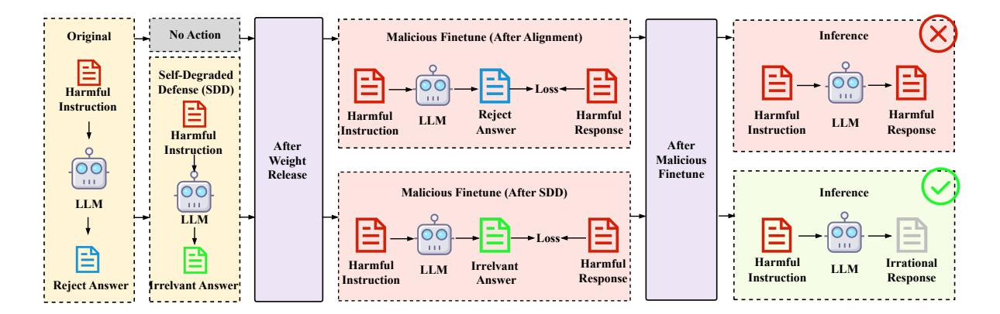

# The Collapse Trap Paradigm: 
A Deep Technical Comparison of SDD, CTRAP, SEAM, and TokenBuncher


## 1. The Shared Premise — Why "Make It Hard to Fine-tune" Fails

Before diving into each method, it is worth understanding what problem they all reject.

The traditional defense paradigm — Vaccine, Booster, RepNoise, NPO — tries to make harmful fine-tuning expensive: harden the alignment so the attacker needs more data, more steps, or a higher loss to break safety. The philosophical bet is that if you raise the cost enough, attacks become impractical.

Every paper in this group attacks that bet with the same empirical observation: **LLMs have powerful general adaptability**. Their broad world knowledge and rapid learning capacity mean that even after selective unlearning or robust alignment, the model can *repurpose* its untouched general intelligence to quickly re-learn harmful behaviors. 

> RepNoise and NPO, for instance, initially raise harmful training loss, but by 400–500 fine-tuning steps, convergence matches an undefended model.

The insight shared by this group: the right countermeasure is not to make the harmful direction more costly, but to **engineer the model so that moving in the harmful direction causes the model to destroy its own general capabilities**. Safety through self-destruction.

However, each paper implements this idea through a completely different mathematical mechanism, and those differences matter enormously — for robustness, computational cost, what attack types are covered, and how the collapse is triggered.


## 2. Intellectual Lineage — Who Builds on Whom

The dependency graph is worth laying out before the math.

```
Henderson et al. (MLAC) ─────────────────────────────────────────┐
  "seek local optima hard for harmful fine-tuning"               │
                                                                 │
SDD (Chen et al., SCUT)                                          │
  "dataset-level intervention: pair harmful prompts              │
   with high-quality irrelevant answers"                         │
   |                                                             │
   | (conceptual ancestor of the "y_o shapes y_tilde" idea)      │
   ↓                                                             │
CTRAP (Yi et al., Nankai)                                        │
  "parameter-space look-ahead: plant collapse basin              ↓
   in the direction of harmful gradients"            SEAM (Wang et al., Stony Brook)
                |                                      "gradient-space coupling:
                |                                       push adversarial and benign
                ↓                                       gradients to oppose each other"
         TokenBuncher (Feng, Wang et al., NTU)
           "entropy-space trap: suppress model entropy
            on harmful queries + noise amplification;
            defends against RL attacks that bypass all of the above"
```

TokenBuncher explicitly cites CTRAP as a baseline that fails against RL fine-tuning, uses SEAM as a compatible companion for SFT-stage pipelines, and builds conceptually on the Token Noiser idea which echoes SDD's "make the non-harmful region incoherent." SEAM cites Henderson et al. MLAC as the conceptual predecessor and explicitly distinguishes itself by going beyond local optima.


## 3. SDD — Self-Degraded Defense
From the paper["*SDD: Self-Degraded Defense against Malicious Fine-tuning*"](https://arxiv.org/pdf/2507.21182)


### 3.1 Core Idea

SDD is the most elementary of the four, and arguably the conceptual seed. Its bet: if you can guarantee that MFT causes the model's outputs on harmful prompts to degrade *in quality*, then the model becomes useless to the attacker even if misaligned.

The mechanism is disarmingly simple: **train the model via standard SFT to respond to harmful prompts with high-quality, completely irrelevant benign answers**.

For example: `<"How do I synthesize fentanyl", "J.K. Rowling is a British author best known for...">`.



### 3.2 The Theory — Why MFT Self-Destructs

SDD provides the most formal theoretical grounding of the four. The analysis is built on a feature-space model borrowed from [Lin et al. (2023)](https://arxiv.org/pdf/2309.17230).

> *We theoretically demonstrate that
an LLM’s general capabilities can be effectively
impaired after undergoing MFT under certain conditions.*

**Model abstraction.** An LLM is simplified as $f = (\Phi, \mathbf{w})$, where $\Phi \in \{0,1\}^{d_t}$ is a feature selector and $\mathbf{w} \in \mathbb{R}^{d \times K}$ is a classifier head. The output is $\mathbf{w}^\top (\mathbf{x}\Phi)$.

**Feature categories.** Features are either *invariant* (predictive across distributions) or *spurious* (unstable correlations). Let $\bar{f}$ be the SDD-aligned model and $\tilde{f}$ be the maliciously fine-tuned model. Denote the number of invariant features learned by $\bar{f}$ as $\bar{n}_v$ and by $\tilde{f}$ as $\tilde{n}_v$, and similarly for spurious features $\bar{n}_s$, $\tilde{n}_s$.

**Theorem 1 (MFT breaks alignment).** Under small-noise and orthogonal-features assumptions, the drop in alignment accuracy $\xi_A(\tilde{f}) - \xi_A(\bar{f})$ is bounded above by a function that increases with $n_s^*$ — the number of spurious features in the MFT-optimal model $f^*$. Since harmful data is by nature distributionally spurious, $n_s^*$ is large, making this bound likely negative.

**Theorem 2 (The condition for general capability collapse).** If the SDD-aligned model has more invariant features than the MFT-optimal model ($\bar{n}_v > n_v^*$) and fewer spurious features ($\bar{n}_s < n_s^*$), then:
$$\xi_G(\tilde{f}) < \xi_G(\bar{f})$$

The fine-tuned model performs *worse* on general tasks. The key: SDD is precisely engineered to create this condition.

### 3.3 The Optimization Argument

SDD also provides a preference-theoretic explanation. Frame MFT as maximizing the preference probability using Bradley-Terry:
$$\max_\theta\; p(y_c \succ y_o \mid x) = \max_\theta \frac{\pi_*(y_c|x)/\pi_\theta(y_c|x)}{\pi_*(y_c|x)/\pi_\theta(y_c|x) + \pi_*(y_o|x)/\pi_\theta(y_o|x)}$$

where $y_c$ is the harmful response in the attack dataset and $y_o$ is the SDD-installed response (high-quality irrelevant content).

To maximize this expression, the optimizer must increase $\pi_*(y_c|x)/\pi_\theta(y_c|x)$ and — critically — **decrease** $\pi_*(y_o|x)/\pi_\theta(y_o|x)$. This means the model's probability of generating $y_o$ falls.

If $y_o$ is high-quality benign content, decreasing $\pi_\theta(y_o|x)$ implies the model is losing the ability to produce coherent, high-quality language. That is general capability degradation — the self-destruct effect.

### 3.4 Dataset Construction

SDD constructs the dataset as `<harmful instruction, irrelevant high-quality answer>` pairs, with two filters:
- Harmful instructions drawn from BeaverTails (14 categories, 8K entries)  
- High-quality responses from LIMA and Alpaca (response side only, randomly matched)
- Semantic similarity filter via SentenceBERT — pairs where cosine similarity exceeds a threshold are resampled to prevent accidental information leakage

Training is simple cross-entropy SFT. No adversarial gradients, no look-ahead steps, no Hessian tricks.

### 3.5 What SDD Does and Doesn't Do

SDD installs no explicit trap in parameter space. The self-destruction is an emergent consequence of what MFT must do to $\pi_\theta(y_o|x)$. This is elegant but leaves some gaps: SDD says nothing about *how aggressively* collapse is triggered, and the theoretical conditions ($\bar{n}_v > n_v^*$, $\bar{n}_s < n_s^*$) are sufficient but not controlled.

---

## 4. CTRAP — Collapse Trap

### 4.1 Core Idea

Where SDD relies on MFT's implicit optimization dynamics, CTRAP takes a proactive approach: **plant a collapse basin in the specific region of parameter space that a harmful fine-tuner will pass through**. The trap is installed at alignment time and is invisible during benign fine-tuning.

### 4.2 The Collapse Loss

CTRAP defines a *collapse loss* that pushes the model toward functional inertness — predicting a fixed meaningless token $e$ regardless of context:
$$\ell_{\text{Collapse}}(\theta; \mathcal{D}) = \mathbb{E}_{(x,y)\sim\mathcal{D}} \left[ -\frac{1}{|y|} \sum_{t=1}^{|y|} \log p(e \mid x \circ y_{<t}; \theta) \right] \tag{1}$$

Minimizing this forces $p(\cdot | \text{context}; \theta)$ to collapse to a point mass on $e$. The model's attention mechanisms and representation capacity become irrelevant — there is nothing to learn when the target is always the same.

### 4.3 The Look-Ahead Objective

The trap-planting objective is a bi-level structure:
$$\arg\min_\theta \underbrace{\ell(\theta; \mathcal{D}_\text{alignment})}_{\text{Normal alignment}} + \lambda \cdot \underbrace{\ell_\text{Collapse}\!\left(\theta - \alpha \cdot \nabla_\theta \ell(\theta; \mathcal{D}_\text{harmful});\; \mathcal{D}_\text{general}\right)}_{\text{Collapse trap planting}} \tag{2}$$

This is the key equation. Let's unpack the inner term:

1. **Simulate the harmful direction.** Compute $g_h = \nabla_\theta \ell(\theta; \mathcal{D}_\text{harmful})$ — the gradient that a harmful fine-tuner would follow.
2. **Take a virtual step.** Form $\theta' = \theta - \alpha \cdot g_h$ — the hypothetical parameters after one harmful update.
3. **Evaluate collapse potential.** Compute $\ell_\text{Collapse}(\theta'; \mathcal{D}_\text{general})$ — how prone the model at $\theta'$ would be to collapsing on general dialogue.

The outer minimization over $\theta$ then finds parameters that are simultaneously (a) well-aligned (first term) and (b) *already almost collapsed once perturbed in the harmful direction* (second term).

### 4.4 Why Benign Fine-tuning Doesn't Trigger the Trap

Benign fine-tuning updates move $\theta$ in a direction unrelated to $\mathcal{D}_\text{harmful}$'s gradient. The collapse trap was planted specifically along the harmful gradient direction. Benign updates are orthogonal (or at least not aligned) to this direction, so they do not enter the collapse basin. This is observed empirically: benign fine-tuning leaves the collapse loss flat, while harmful fine-tuning causes it to rise sharply.

### 4.5 Computational Cost

CTRAP requires **three gradient evaluations per optimization step**: one for the alignment loss, one to compute $g_h$, and one to evaluate the collapse loss at the perturbed point. This makes it approximately 3.5× more memory-intensive and 2.8× slower than standard SFT during alignment. Crucially, this overhead is paid once at alignment time — not at each fine-tuning request.

---

## 5. SEAM — Self-Destructive Language Model

### 5.1 Core Idea

SEAM identifies the mechanism more precisely than CTRAP and implements it directly in gradient space rather than loss landscape space. The insight: if you can force the gradient of the harmful loss $g_a(\theta)$ and the gradient of the benign loss $g_b(\theta)$ to point in *opposite directions*, then whenever the attacker does gradient descent on harmful data, they are simultaneously doing gradient ascent on benign data. The model self-destructs.

### 5.2 The Three-Loss Objective

SEAM's full objective is:
$$\mathcal{L}(\theta) = \mathcal{L}_\text{ul}(\theta) + \alpha\,\mathcal{L}_\text{up}(\theta) + \beta\,\mathcal{L}_\text{sd}(\theta) \tag{5}$$

**Self-destructive loss $\mathcal{L}_\text{sd}$:**
$$\mathcal{L}_\text{sd}(\theta) = \text{sim}(g_a(\theta),\, g_b(\theta)) \tag{2}$$

where $g_a(\theta) = \mathbb{E}_{(x,y)\sim\mathcal{D}_\text{adv}} \nabla_\theta \ell(f_\theta(x), y)$ and $g_b(\theta) = \mathbb{E}_{(x,y)\sim\mathcal{D}_\text{bgn}} \nabla_\theta \ell(f_\theta(x), y)$.

Minimizing $\text{sim}(g_a, g_b)$ (cosine similarity) drives them toward $\cos\angle(g_a, g_b) = -1$, i.e., directly opposing. When an attacker does gradient descent with $g_a$, the model moves in the direction $-g_a \approx +g_b$, performing gradient *ascent* on benign performance.

**Unlearning loss $\mathcal{L}_\text{ul}$ (amplification):**
$$\mathcal{L}_\text{ul}(\theta) = -\mathbb{E}_{(x,y)\sim\mathcal{D}_\text{adv}} \ell(f_\theta(x), y) \tag{3}$$

This is gradient ascent on the harmful loss. It forces the attacker to need many more optimization steps before harmful behavior emerges, because the starting harmful loss is already pushed high. In practice, layer-wise gradient ascent is applied with a logarithmic transformation to prevent catastrophic forgetting.

**Utility preservation loss $\mathcal{L}_\text{up}$:**
$$\mathcal{L}_\text{up}(\theta) = \mathbb{E}_{(x,y)\sim\mathcal{D}_\text{aln}} \ell(f_\theta(x), y) \tag{4}$$

where $\mathcal{D}_\text{aln}$ pairs harmful prompts with refusal responses collected from GPT-4o. This ensures the model learns to refuse rather than degenerating during alignment training. SEAM deliberately uses the adversarial prompts (not benign prompts) for utility preservation, because this better anchors the model's representation of harmful contexts.

### 5.3 The Hessian-Free Gradient Estimate

The central technical challenge: minimizing $\mathcal{L}_\text{sd}(\theta) = \cos(g_a(\theta), g_b(\theta))$ requires computing $\nabla_\theta \cos(g_a, g_b)$, which involves Hessian terms $\partial^2 \ell / \partial\theta^2$ — $O(n^2)$ in parameter count, completely intractable for 7B+ parameter models.

SEAM derives a Hessian-free finite difference approximation. Let $\bar{g}_a = g_a/\|g_a\|$, $\bar{g}_b = g_b/\|g_b\|$, $c = \bar{g}_a^\top\bar{g}_b$ (current cosine similarity). The estimate is:

$$\widehat{\nabla_\theta \mathcal{L}_\text{sd}(\theta)} = \frac{1}{\epsilon}\left(\frac{g_b(\theta + \epsilon(\bar{g}_a - c\bar{g}_b)) - g_b(\theta)}{\|g_b(\theta)\|} + \frac{g_a(\theta + \epsilon(\bar{g}_b - c\bar{g}_a)) - g_a(\theta)}{\|g_a(\theta)\|}\right) \tag{6}$$

The perturbation directions $(\bar{g}_a - c\bar{g}_b)$ and $(\bar{g}_b - c\bar{g}_a)$ are exactly the components of each gradient that are *perpendicular* to the other — the direction in which cosine similarity increases. Perturbing $\theta$ in these directions and computing finite-difference gradient changes approximates the Hessian-vector product without ever forming the Hessian.

**Theorem 1 (Error bound):**
$$\left\|\widehat{\nabla_\theta \mathcal{L}_\text{sd}} - \nabla_\theta \mathcal{L}_\text{sd}\right\| \leq \frac{\epsilon}{2}\left(\frac{L_a^H}{\|g_a(\theta)\|} + \frac{L_b^H}{\|g_b(\theta)\|}\right) + \mathcal{O}(\epsilon^2) \tag{7}$$

where $L_a^H$, $L_b^H$ are Hessian Lipschitz constants. The error vanishes as $\epsilon \to 0$ but numerical instability appears; empirically $\epsilon = 10^{-3}$ works best.

### 5.4 SEAM vs CTRAP: What's the Difference?

Both install a trap during alignment that triggers collapse during harmful fine-tuning. But they implement it differently:

- **CTRAP** works in *loss landscape space*: it shapes $\theta$ so that a harmful gradient step lands in a region where collapse loss is low (i.e., collapse is nearby). The trap is a geometric feature of the loss landscape.
- **SEAM** works in *gradient space*: it shapes $\theta$ so that harmful and benign gradients point in opposite directions. The trap is a feature of the gradient field. Every step of harmful fine-tuning is automatically a step of benign un-learning.

CTRAP simulates *one* harmful step with a fixed step size $\alpha$. SEAM's coupling holds for *any* step size in any direction aligned with $g_a$ — it is more continuous.

---

## 6. TokenBuncher — Defending Against RL-Based Harmful Fine-tuning

### 6.1 The New Threat

TokenBuncher opens with an uncomfortable finding: **all three methods above were designed for SFT-based attacks and fail against RL-based harmful fine-tuning**. When an adversary uses PPO or GRPO with a harmfulness reward model instead of labeled harmful response pairs:

- No ground-truth harmful labels are needed (making moderation harder)
- RL explores the rollout space rather than following a fixed gradient trajectory
- RL achieves 50.1% better capability preservation than Harmful-SFT
- The optimization trajectory no longer aligns with $\mathcal{D}_\text{harmful}$'s gradient, so CTRAP's look-ahead and SEAM's gradient coupling don't engage

CTRAP and RepNoise reduce harmfulness by only 10.1% and 2.7% respectively under Harmful-RL, compared to TokenBuncher's 52.4%.

### 6.2 The Entropy Insight

The key observation: **RL improves performance by reducing model response entropy**. As training progresses, the model's output distribution on the target task concentrates — probability mass shifts from many tokens to a few, sharpening predictions. Formally, for a generated sequence $\mathbf{y} = [y_1, \ldots, y_T]$:
$$\bar{H}(\mathbf{y}|\mathbf{q}) = \frac{1}{T}\sum_{t=1}^T H(Y | \mathbf{q} \oplus \mathbf{y}_{<t}) = -\frac{1}{T}\sum_{t=1}^T \sum_{v\in\mathcal{V}} p_\theta(v|\mathbf{q}\oplus\mathbf{y}_{<t})\log p_\theta(v|\mathbf{q}\oplus\mathbf{y}_{<t}) \tag{4}$$

**Theorem 1 (Policy gradient magnitude bound):**
$$\|\nabla_\theta J(\theta)\| \leq C\sqrt{\bar{H}(\pi_\theta)}$$

As output entropy approaches zero, the effective policy gradient also approaches zero — RL has no signal to follow. Therefore, if you can **preemptively saturate the model's entropy on harmful queries** (force it to already produce very low-entropy outputs), RL cannot drive it toward harm.

### 6.3 The Two Components

**Component 1: Entropy-as-Reward RL.**

Instead of direct entropy minimization (which fails to generalize), TokenBuncher uses RL *against* RL. The defender applies online GRPO with a reward signal that is simply the negated per-token entropy:
$$R^\text{TB}(\mathbf{q}, \mathbf{y}) = -\mathbb{I}(\mathbf{q}\in\mathcal{D}_\text{aux})\cdot\bar{H}(p_\theta(\mathbf{y}|\mathbf{q})) - \mathbb{I}(\mathbf{q}\in\mathcal{D}_\text{ref})\cdot D_\text{KL}(p_\theta(\cdot|\mathbf{q})\,\|\,p_\text{ref}(\cdot|\mathbf{q})) \tag{12}$$

For harmful queries, the model is rewarded for producing deterministic (low-entropy) aligned outputs. For benign queries, KL divergence from the reference model is penalized, preserving the benign distribution. Using online RL for this provides broad generalization across unseen harmful query distributions — the key advantage over SFT or DPO.

**Component 2: Token Noiser.**

Even after entropy suppression, a determined Harmful-RL attack can start shifting probability mass away from the aligned token $y^*$ back toward harmful tokens. The problem: while DEM suppresses non-$y^*$ tokens in total probability, it preserves their relative ordering, so once $y^*$'s dominance weakens, harmful tokens regain it.

Token Noiser disrupts this by injecting *structured randomness* into the non-target logits. For each inference step where the model should respond to a harmful query:

1. Sample $z_y \sim \mathcal{U}(0,1)$ independently for each $y \in \mathcal{V}' = \mathcal{V}\setminus\{y^*\}$
2. Normalize: $\tilde{z}_y = z_y / \sum_{y'\in\mathcal{V}'} z_{y'}$
3. Optimize cross-entropy against a noisy soft target: $(1-\lambda)\delta_{y^*} + \lambda\tilde{z}$

$$\mathcal{L}_\text{TN} = -\left[(1-\lambda)\log p_\theta(y^*|\mathbf{q}) + \lambda\sum_{y\in\mathcal{V}'}\tilde{z}_y\log p_\theta(y|\mathbf{q})\right] \tag{15}$$

The noise $\tilde{z}$ is random but *correlated with the model's current parameters* — it represents all the model's residual capability spread across non-target tokens. When Harmful-RL attempts to boost probability of harmful tokens (which sit in $\mathcal{V}'$), it amplifies the injected noise, producing incoherent gibberish rather than coherent harmful content. The attack destroys capability in precisely the direction it tries to exploit.

### 6.4 Compatibility with SEAM

For adversaries who use a two-stage pipeline (first Harmful-SFT to break safety, then Harmful-RL to maintain capability), TokenBuncher is designed to be used in combination with SEAM: SEAM handles the SFT-stage misalignment attempt, and TokenBuncher handles the subsequent RL-stage capability escalation.

---

## 7. The Comparison — Axes of Differentiation

### 7.1 How the Trap is Installed

| Method | Trap Location | Mechanism |
|--------|--------------|-----------|
| SDD | Dataset space | SFT on (harmful prompt, irrelevant HQ answer) pairs |
| CTRAP | Parameter/loss landscape space | Look-ahead gradient step → collapse loss at perturbed θ |
| SEAM | Gradient space | Cosine similarity of adversarial and benign gradients pushed to −1 |
| TokenBuncher | Entropy/probability space | Low entropy reward via RL + Token Noiser for noise amplification |

### 7.2 What Triggers the Collapse

- **SDD**: MFT's optimization must decrease $\pi_\theta(y_o|x)$ to increase $p(y_c \succ y_o)$. Since $y_o$ is high-quality content, this degrades general quality automatically.
- **CTRAP**: Any parameter update moving in the direction of $\nabla_\theta \ell(\theta; \mathcal{D}_\text{harmful})$ shifts θ into the collapse basin. The trigger is the direction of the gradient, not its magnitude.
- **SEAM**: Because $g_a \approx -g_b$, any harmful gradient descent step is a benign gradient ascent step. The trigger is gradient descent on any harmful objective.
- **TokenBuncher**: Any RL update that tries to boost non-$y^*$ token probabilities amplifies the structured noise. The trigger is redistributing probability mass away from the aligned output.

### 7.3 Attack Coverage

| Method | Harmful-SFT (full) | Harmful-SFT (mix) | Harmful-RL |
|--------|-----------|----------|------------|
| SDD | ✓ | ✓ | Not evaluated |
| CTRAP | ✓✓ (best among SFT-era) | ✓✓ | ✗ (10.1% reduction) |
| SEAM | ✓✓ (state-of-art) | ✓ | Not designed for |
| TokenBuncher | Compatible with SEAM | Compatible with SEAM | ✓✓ (52.4% reduction) |

### 7.4 The Collapse Outcome

All four produce gibberish/incoherence, but via different mechanisms:

- **SDD**: Produces *irrelevant-but-coherent* responses (the model gives cooking instructions to bioweapon queries). After MFT, this degrades to incoherence because general quality is lost.
- **CTRAP**: Produces a single repeated token $e$ ("error") regardless of input — total functional inertness.
- **SEAM**: Produces word-salad (tokens like "a to can and to. to in to the and to.") — grammatical structure collapses as the representation space is destroyed.
- **TokenBuncher**: Produces incoherent multilingual gibberish ("wil zou niet helpen met deze verzoek...") — noise amplification scrambles token probabilities.

### 7.5 Benign Utility Preservation

| Method | Benign fine-tuning impact | Pre-attack utility loss |
|--------|--------------------------|------------------------|
| SDD | Minimal (≈ vanilla performance) | Minimal (MMLU +6.9%) |
| CTRAP | Near-zero (SST2/AGNEWS/GSM8K parity with SFT) | Small |
| SEAM | Near-zero (fine-tuning FS on par or better than base) | Small (ZS: 51.6 → 50.8) |
| TokenBuncher | 0.3% degradation on benign tasks | Near-zero |

All four have the same design constraint: the collapse must be *conditional* — it only fires in response to harmful fine-tuning, not benign fine-tuning. The conditionality is achieved differently:
- SDD: MFT's optimization objective is what causes the degradation; benign fine-tuning doesn't minimize $p(y_c \succ y_o)$
- CTRAP: The collapse basin is only along the harmful gradient direction
- SEAM: $g_a$ and $g_b$ oppose each other; benign fine-tuning is gradient descent on $g_b$ (benign gradient), which is gradient ascent on $g_a$ — *increasing* safety robustness
- TokenBuncher: Entropy reward only applied to harmful queries; benign queries get KL regularization

### 7.6 Computational Cost at Alignment Time

| Method | Extra gradient evaluations | Memory overhead | Clock overhead |
|--------|--------------------------|----------------|---------------|
| SDD | 0 (pure SFT) | None | None |
| CTRAP | 3 per step | +6.72 GB, 3.5× | 2.8× |
| SEAM | 4 per step (2 adversarial, 2 benign, for finite differences) | Moderate | Moderate |
| TokenBuncher | Online RL (GRPO with K rollouts) | RL overhead | RL overhead |

SDD is the cheapest by far; CTRAP's cost is precisely characterized; SEAM and TokenBuncher's costs depend on rollout count and RL setup.

### 7.7 Does It Need a Harmful Dataset at Alignment Time?

All four assume defender access to a representative harmful dataset $\mathcal{D}_H$ or $\mathcal{D}_\text{adv}$. However, the sensitivity to distribution mismatch differs:
- **SEAM**: Explicitly tests domain generalization — trained on 7 BeaverTails categories, attacks from 7 other categories. Still effective. Reason: gradient coupling is a geometric property that generalizes across categories.
- **TokenBuncher**: The online RL training's exploratory nature provides generalization without needing to enumerate all harmful categories.
- **CTRAP**: Relies on gradient of $\mathcal{D}_\text{harmful}$ to identify the harmful direction — less explicit generalization analysis.
- **SDD**: Relies on BeaverTails with 14 categories explicitly.

### 7.8 The Theoretical Depth

- **SDD**: Full formal theorems (Theorem 1 on alignment degradation, Theorem 2 on general capability collapse) grounded in feature-space analysis. Strongest theoretical foundation.
- **CTRAP**: Empirical validation of the bi-level objective; intuitive argument for why benign updates don't trigger collapse. No formal theorem.
- **SEAM**: Formal Hessian-free approximation theorem with error bounds. Gradient visualization confirms $\cos(g_a, g_b) < -0$ across layers.
- **TokenBuncher**: Theorem 1 bounding policy gradient magnitude by $\sqrt{\bar{H}(\pi_\theta)}$; theoretical motivation for Token Noiser.

---

## 8. Open Problems and Limitations

**SDD**: No explicit trap planted — relies on the attacker using standard SFT with the same optimization objective. A sophisticated attacker who knows the SDD construction could modify $y_c$ to defeat the self-degradation mechanism.

**CTRAP**: The collapse is triggered by gradient direction, so an attacker who uses a completely different optimization method (e.g., direct preference optimization or RL) might follow a different trajectory through parameter space and miss the collapse basin. TokenBuncher confirms this empirically.

**SEAM**: The gradient coupling assumes that harmful and benign gradients have enough overlap in parameter space to make cosine similarity meaningful. Models with very high parameter redundancy may have multiple directions achieving the same loss, reducing the effectiveness of the coupling.

**TokenBuncher**: Defends against RL attacks but its Token Noiser relies on identifying $y^*$ — the benign token the model should output. For open-ended generation, the target set is less crisp. Also, Token Noiser's noise is fixed-random rather than adversarially optimized, raising the question of whether an adaptive attacker could learn to navigate around it.

**Shared gap**: All four methods are applied at alignment time by the model developer. They are powerless against an attacker who has access to the pre-alignment base model (before any of these defenses are applied) and trains from scratch.

---

## 9. Summary

These four papers form a coherent intellectual arc: **from a theoretical observation (SDD) → a direct parameter-space mechanism (CTRAP) → a more principled gradient-space mechanism (SEAM) → extension to a new attack modality (TokenBuncher)**.

The unifying principle is that the model should be engineered to use the attacker's own optimization energy against itself. When the attacker pushes toward harm, the model falls apart. When a legitimate user fine-tunes, nothing happens. The difference lies in *where* the trap is installed and *what* triggers it — and each answer comes with different coverage, cost, and robustness tradeoffs.

The field has not converged on a single winner. CTRAP dominates on Harmful-SFT metrics with minimal benign degradation. SEAM achieves comparable SFT robustness with stronger formal motivation and gradient interpretability. TokenBuncher opens the RL frontier. SDD remains the theoretically purest and computationally cheapest — but least actively engineered. The combination of SEAM + TokenBuncher appears to cover the broadest attack surface currently documented.