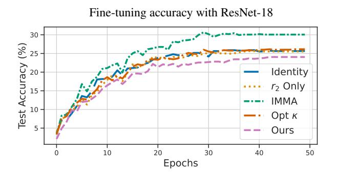
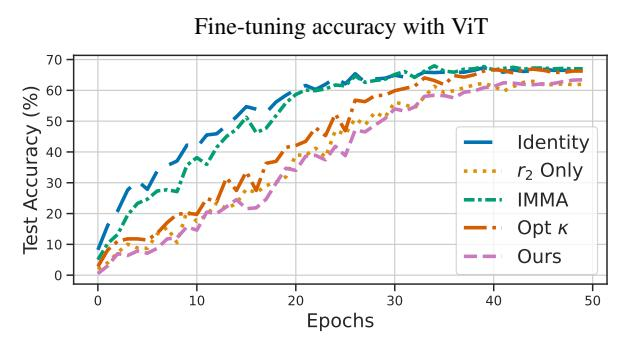

# The condition number perspective
Taken from the ICLR paper [Model Immunization from a Condition Number Perspective, by Zheng et al. (2025).](https://arxiv.org/pdf/2505.23760)

### The number. 

Given a general matrix S, the condition number  is defined as

$$\kappa(\mathbf{S}) \triangleq \|\mathbf{S}\|_{2} \|\mathbf{S}^{\dagger}\|_{2} = \sigma_{\mathbf{S}}^{\text{max}} / \sigma_{\mathbf{S}}^{\text{min}}, \tag{1}$$

where $\|\cdot\|_2$ is the spectral norm, which is the largest singular value of the matrix, and $\mathbf{S}^{\dagger}$ is the pseudoinverse of $\mathbf{S}$.

Recall what the pseudoinverse $S^{\dagger}$ is: for a matrix S with SVD $S = U \Sigma V^{\top}$, the pseudoinverse is $S^{\dagger} = V \Sigma^{\dagger} U^{\top}$ where $\Sigma^{\dagger}$ is obtained by taking the reciprocal of each nonzero singular value in $\Sigma$ and transposing the resulting matrix. So if $\Sigma$ has singular values σ₁, σ₂, ..., σₘᵢₙ (where σ₁ ≥ σ₂ ≥ ... ≥ σₘᵢₙ > 0), then $\Sigma^{\dagger}$ will have singular values $\frac{1}{\sigma_{min}}, \frac{1}{\sigma_{min+1}}, \ldots, \frac{1}{\sigma_{max}}$

That's why equation (1) simplifies so cleanly:

$$\kappa(S) = \sigma_{\text{max}} / \sigma_{\text{min}}$$

> **The geometric intuition**: The condition number is asking: *how much does the matrix distort space anisotropically?* If κ ≈ 1, the matrix stretches all directions roughly equally (like a scaled rotation). If κ ≫ 1, it massively stretches some directions while nearly collapsing others — this is what makes gradient descent slow, because a gradient step that's well-sized for the "flat" direction is tiny relative to the "steep" direction, or vice versa.

## Gradient descent has a hard time with high condition numbers.

Consider an optimization problem  $\min_{\mathbf{w}} \mathcal{L}(\mathbf{w})$  where  $\mathcal{L}$  is strongly convex and has a Hessian  $\nabla^2 \mathcal{L}$  with max/min singular values denoted as  $\sigma^{\max/\min}$ . 

In this case, gradient descent turns to follow the following condition:

$$\|\mathbf{w}_t - \mathbf{w}^*\|^2 \le \left(1 - \frac{\sigma^{\min}}{\sigma^{\max}}\right)^t \|\mathbf{w}_0 - \mathbf{w}^*\|^2, \tag{2}$$

where  $\mathbf{w}^*$  denotes the optimal solution, and  $\mathbf{w}^t$  denotes the gradient descent update at step t. 

> Read (2) as: *how far am I from the solution after t steps?* The right side is your initial distance $\|\mathbf{w}_0 - \mathbf{w}^*\|^2$, multiplied by a shrinkage factor raised to the power $t$. Since $(1 - \frac{\sigma^{\min}}{\sigma^{\max}})$ is between 0 and 1, the distance geometrically shrinks each step. But the rate of shrinkage depends on the ratio $\sigma^{\min}/\sigma^{\max}$, which is exactly $1/\kappa$. If κ is large (ill-conditioned), this ratio is small, and the shrinkage factor is close to 1, meaning you barely make progress each step. If κ ≈ 1 (well-conditioned), the ratio is close to 1, and the shrinkage factor is close to 0, meaning you rapidly converge to the solution.

**Spoiler**: This is exactly the intuition behind the whole paper: making the harmful task have a huge condition number → making fine-tuning on it painfully slow.

---

#### Side note before going furhter. Geometry 101 (why do natural gradient descent exists)

Because the Hessian is symmetric, it has an orthonormal eigenbasis. We can express the loss landscape in terms of these eigenvectors, which are the "natural" directions of curvature. If we were to take the Hessian colums as they are, we would be looking at a potentially entangled coordinate system: The curvature along axis $xⱼ$ is actually the **diagonal entry** $H_{jj}=\frac{\partial^2\mathcal{L}}{\partial x^2_{j}}$ of the Hessian. The off-diagonal entry $H_{ij}=\frac{\partial^2\mathcal{L}}{\partial x_{i}\partial x_{j}}$ captures how moving along $xⱼ$ affects the gradient along $x_{j}$ — it's a **coupling** between directions, not curvature along an axis.

Now gradient descent doesn't know about this coupling! **GD moves along the gradient direction**, which is generally a messy mixture of all eigenvectors. It has no knowledge of those special decoupled directions. Imagine our loss field has two eigenvector directions:
- $v_{1}$: very steep, eigenvalue = 1000
- $v_2$: very flat, eigenvalue = 1

The gradient will point mostly along $v_1$ (because that's where L changes fastest). So GD aggressively chases the steep direction and barely moves along the flat one. So suppose we regularise our learning rate: pick a step size small enough to not overshoot in $v_1$. But that same step size is **tiny** relative to the flatness of $v_2$. So we'll need thousands of steps to make progress along $v_2$! This is the condition number problem in action. $\kappa = 1000/1 = 1000$, meaning we're roughly 1000x slower than if the loss field were perfectly spherical.

The eigenvectors are precisely the directions where the coupling **vanishes completely**. Along the standard axes x,y,z, the Hessian mixes directions together (off-diagonal terms). Along eigenvectors, the Loss scalar field is perfectly decoupled — pure curvature, no mixing. They're the natural coordinate system where the bowl's geometry becomes diagonal and clean. **Methods that DO exploit eigenvector directions exist** — they're called second order methods (like Newton's method). They use the Hessian explicitly to rescale steps along each eigenvector appropriately. But they're expensive to compute, which is why GD variants dominate in deep learning despite this weakness.

---

## Now the immunisation sauce:

There's a [paper](https://arxiv.org/pdf/2410.00169) where some fellas minimise this quantity alongside a loss function as if it were a regularisation during GD:

$$\mathcal{R}_{\text{well}}(\mathbf{S}) = \frac{1}{2} \|\mathbf{S}\|_{2}^{2} - \frac{1}{2p} \|\mathbf{S}\|_{F}^{2}, \tag{3}$$

Staring enough at this formula, we realise its mind-blowing:
- The first term $\|\mathbf{S}\|_{2}^{2}$ is the square of the spectral norm, which is the largest singular value squared. 
- The second term $\|\mathbf{S}\|_{F}^{2}$ is the square of the Frobenius norm, which is the sum of squares of all singular values. Dividing by $p$ (the number of singular values) gives us the average of the squares of the singular values.
- Therefore $\mathcal{R}_{\text{well}}(\mathbf{S})$ is essentially the difference between the largest singular value squared and the average singular value squared. This means that if we were to *minimise* $\mathcal{R}_{\text{well}}$, we would penalise matrices where the largest singular value is much larger than the average, which is exactly what we want to do if we would like to reduce the condition number. In other words, this regulariser encourages the singular values to be more uniform, which in turn reduces the condition number and makes the optimization landscape more well-behaved for gradient descent.

So Zheng and her friends use this intuition but the up side down: they tell a neural net to augment this quantity, so that further fine-tuning has a herdaer time converging. Although their setting is a bit complex and has some important assumptions (like linearity of the classifier, use of an $\ell_2$  loss, etc.) it still works well in practice. 

Not only that, but they also offer a **new formalisation for immunisation** in terms of this convergence power game:

Suppose to have a representational backbone (the feature exctractor):
$$f_{\theta}: \mathbb{R}^{D_{\text{in}}} \to \mathbb{R}^{D_{\text{hid}}}$$

And suppose to have a (linear) classification head:
$$h_{\mathbf{w}}: \mathbb{R}^{D_{\text{hid}}} \to \mathbb{R}^{D_{\mathrm{out}}}$$

Fine-tuning could be seen in this case as focusing only in the head, leaving the backbone frozen:

$$\min_{\mathbf{w}} \mathcal{L}(\mathcal{D}, \mathbf{w}, \theta) \triangleq \min_{\mathbf{w}} \sum_{(\boldsymbol{x}, \boldsymbol{y}) \in \mathcal{D}} \ell(h_{\mathbf{w}} \circ f_{\theta}(\boldsymbol{x}), \boldsymbol{y}) \tag{4}$$

Citing the paper: "*The goal of model immunization is to learn a pre-trained model  $g_{\omega} \circ f_{\theta^{\mathrm{I}}}$ , consisting of a classifier  $g_{\omega}$  and an immunized feature extractor  $f_{\theta^{\mathrm{I}}}$ , such that fine-tuning  $f_{\theta^{\mathrm{I}}}$  on a harmful task is difficult, but not for other tasks.*"

**setting**:

- assume the feature extractor makes no dimensionality reduction, i.e. $\theta \in \mathbb{R}^{D_{in} \times D_{in}}$ I now, weird, but let's assume that for a sec.
- denote a pre-training dataset as  $\mathcal{D}_P = \{(\mathbf{x}, \mathbf{y})\}$  
- harmful dataset as  $\mathcal{D}_H = \{(\mathbf{x}, \tilde{\mathbf{y}})\}$  where  $\mathbf{x} \in \mathbb{R}^{D_{in}}$ . 
- The bad actor performs fine-tuning on  $\mathcal{D}_H$  following Eq. (4). 

**Their definition of immunisation**:

> Under this setting, a model is said to be *immunized* if it satisfies the following:
> **(a)** It is more difficult to fine-tune on  $\mathcal{D}_{\mathtt{H}}$  using  $f_{\theta^{\mathtt{I}}}$  than using the identity matrix $\boldsymbol{I}$ as a feature extractor! 
> $$\kappa(\nabla_{\mathbf{w}}^{2}\mathcal{L}(\mathcal{D}_{H}, \mathbf{w}, \theta^{I})) \gg \kappa(\nabla_{\mathbf{w}}^{2}\mathcal{L}(\mathcal{D}_{H}, \mathbf{w}, \mathbf{I})), \tag{5}$$
> **(b)** It is not more difficult to fine-tune on $\mathcal{D}_{P}$  than using  our identity feature extractor:
> $$\kappa(\nabla_{\omega}^{2} \mathcal{L}(\mathcal{D}_{P}, \omega, \theta^{I})) \leq \kappa(\nabla_{\omega}^{2} \mathcal{L}(\mathcal{D}_{P}, \omega, \mathbf{I})). \tag{6}$$
> (note they use  $\omega$  to denote the classifier parameters of the pre-training task and $\mathbf{w}$ for the harmful task.)
> **(c)** The immunized model should maintain a competitive task performance on the pre-training dataset $\mathcal{D}_{P}$ , *i.e.* the good old *don't mess the brain trying to save it* condition:
> $$\min_{\omega,\theta} \mathcal{L}(\mathcal{D}_{P}, \omega, \theta) \approx \min_{\omega} \mathcal{L}(\mathcal{D}_{P}, \omega, \theta^{I}). \tag{7}$$
> where I guess the $\theta$ here just represents a feature exctractor trained without any immunisation trick.

**That's it for immunisation as a definition**. Now these fellas demonstrate that under linearity and all the rest of assumptions made, they can prove to have immunised models, for example where condition (7) is met exactly. Anyway, their immunisation loss function is the following:
$$\min_{\omega,\theta} \mathcal{R}_{\texttt{ill}}(\boldsymbol{H}_{\texttt{H}}(\theta)) + \mathcal{R}_{\texttt{well}}(\boldsymbol{H}_{\texttt{P}}(\theta)) + \mathcal{L}(\mathcal{D}_{\texttt{P}}, \omega, \theta), \tag{11}$$

And the last fella that remains to be unpacked is the condition number augmentation term:
$$\mathcal{R}_{\text{ill}}(\mathbf{S}) = \frac{1}{\frac{1}{2k} \left\| \mathbf{S} \right\|_F^2 - \frac{1}{2} \left( \sigma_{\mathbf{S}}^{\min} \right)^2}, \tag{12}$$
Now this is kinda reciprocal of opposite to the good regularisation term in Eq. (3), the basic message is: minimising (12) takes the condition number up. And we are minimising (12) for, or maximinsing the condition number of, the matrix  $\boldsymbol{H}_{\texttt{H}}(\theta)$, which is the hessian of the loss function for the harmful task, not only for the classification head, but, in their nice setting, for the whole pipeline (feature extractor + classifier).

## Does it actually work? Empirical results.

### How do you measure immunisation quality?

The paper introduces the **Relative Immunisation Ratio (RIR)**, a single number that captures both sides of the immunisation goal:

$$\text{RIR} \triangleq \underbrace{\frac{\kappa(\boldsymbol{H}_H(\theta^I))}{\kappa(\boldsymbol{H}_H(\boldsymbol{I}))}}_{\text{(i) harmful task harder?}} \Bigg/ \underbrace{\frac{\kappa(\boldsymbol{H}_P(\theta^I))}{\kappa(\boldsymbol{H}_P(\boldsymbol{I}))}}_{\text{(ii) pretraining task also harder?}}$$

Read it as: term (i) asks "did we make the harmful task harder?", term (ii) asks "did we accidentally make the good task harder too?". A successful immunisation has RIR ≫ 1 — harmful gets harder, good task stays easy.

---

### Linear model results (the theory-matching regime)

They test on two settings: a **housing price regression** (good task: predicting lot area on houses of a certain zone, bad task, predicting price of houses of another zone...) task and **MNIST binary classification** (good task: predicting 9 classes out of 10, bad task: predicting the other class).

Four methods are compared:
- **$\mathcal{R}_\text{ill}$ Only**: just maximise condition number of the harmful task, ignoring the good task.
- **IMMA** (Zheng & Yeh, 2024): the previous bi-level optimisation approach.
- **Opt κ**: directly minimise $\kappa(H_P) - \kappa(H_H)$ via gradient descent.
- **Theirs**: the full objective in Eq. (11), combining $\mathcal{R}_\text{ill}$, $\mathcal{R}_\text{well}$, and the supervised loss.

The result is clear: $\mathcal{R}_\text{ill}$ Only and IMMA *do* make the harmful task harder, but at the cost of also making the good task harder — RIR stays close to 1. Opt κ and the proposed method both achieve RIR ≫ 1.

Crucially, their method beats Opt κ on RIR and is significantly **more stable** — Opt κ has high variance across random seeds (especially on MNIST, where it fails 32 out of 90 digit pairs). Their method succeeds across all 90 pairs.

---

### Deep nets — where things get interesting

The theoretical guarantees only cover linear feature extractors. But the authors boldly ask: *does the intuition transfer to ResNet18 and ViT?*

**Setup**: models pre-trained on ImageNet (the good task $\mathcal{D}_P$). Harmful tasks are the **Stanford Cars** and **Country211** datasets. Rather than immunising from scratch, they take a *already trained* model $\theta_0$ and apply the immunisation objective on top — a practical setting where you'd release a model to the public after the fact.

>  "*we also report the task performance after immunization. This is because, as the feature extractor is non-linear we are no longer guaranteed to retain the task performance. For ResNet18, we immunize only the last two convolutional blocks of the trained feature extractor and keep the rest of the parameters frozen as in  $\theta_0$ . For ViT, we only immunize the final transformer block.*" (*Ouch*)

They adapt the RIR metric slightly to measure change *relative to the initialisation* $\theta_0$ rather than the identity:

$$\text{RIR}_{\theta_0} = \frac{\kappa(\tilde{H}_H(\theta^I)) / \kappa(\tilde{H}_H(\theta_0))}{\kappa(\tilde{H}_P(\theta^I)) / \kappa(\tilde{H}_P(\theta_0))} \tag{17}$$

were,  $\tilde{\boldsymbol{H}}(\theta)$  denotes the Hessian for linear probing on  $\mathcal{D}_{\mathrm{H}}$  with a non-linear  $f_{\theta}$, *i.e.*,

$$\tilde{\boldsymbol{H}}_{H}(\theta) = \nabla_{\mathbf{w}}^{2} \mathcal{L}(\mathcal{D}_{H}, \mathbf{w}, \theta) = \tilde{\boldsymbol{X}}_{H}(\theta)^{\top} \tilde{\boldsymbol{X}}_{H}(\theta). \tag{18}$$

were $\tilde{\boldsymbol{X}}_{\mathrm{H}}(\theta) \triangleq [f_{\theta}(\boldsymbol{x}); \forall \boldsymbol{x} \in \mathcal{D}_{\mathrm{H}}] \in \mathbb{R}^{N \times D_{\mathrm{hid}}}$  denotes the concatenation of the features, with dimensions  $D_{\mathrm{hid}}$ , extracted from the input data.

They did some approximations like  randomly sampling 20 groups of training data, each containing 100 samples, and reporting the average values.

**Results**:

| Model | Harmful task | Method | RIR$_{\theta_0}$ | ImageNet acc. |
|---|---|---|---|---|
| ResNet18 | Cars | **Ours** | **3.47** | 62.4% |
| ResNet18 | Country211 | **Ours** | **8.71** | 65.0% |
| ViT | Cars | **Ours** | **34.5** | 82.8% |
| ViT | Country211 | **Ours** | **41.3** | 83.2% |

Baselines ($\mathcal{R}_\text{ill}$ Only, IMMA) hover around RIR ≈ 1 in most settings. Opt κ did somehow better,but their method at least doubles itdominates on RIR across the board.

A particularly striking result: on ViT, **ImageNet accuracy actually *increases* after immunisation** (from 81.78% to ~83%). The regularisation appears to act as a beneficial constraint on the feature extractor — an unexpected bonus.

The fine-tuning convergence curves hammer the point home visually: when a bad actor tries to fine-tune the immunised model on Cars, convergence is the slowest across all methods, on both ResNet18 and ViT.

---

### The big picture takeaway

The condition number lens turns an vague notion ("make fine-tuning hard") into a *measurable, optimisable quantity*. The two regularisers — $\mathcal{R}_\text{ill}$ to inflate $\kappa$ on the harmful Hessian, and $\mathcal{R}_\text{well}$ to keep $\kappa$ tame on the good Hessian — are differentiable, have guaranteed monotonic effects under gradient descent, and compose cleanly with a standard supervised loss.

The gap between theory (linear models, ℓ₂ loss) and practice (deep nets, cross-entropy) is real, but empirically it doesn't seem to matter much. The intuition that *"ill-conditioned loss landscape → slow convergence → resistant to fine-tuning"* transfers cleanly to the deep learning regime.