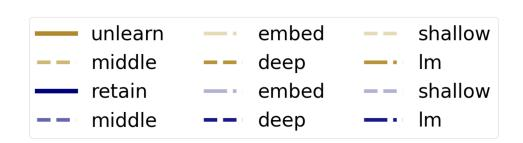
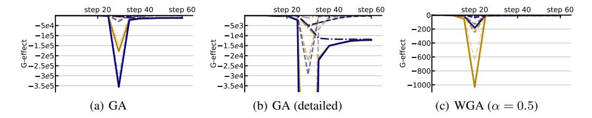
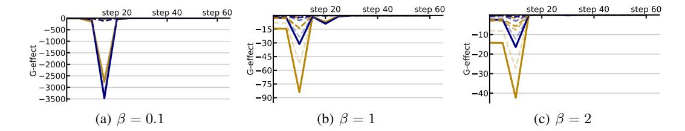
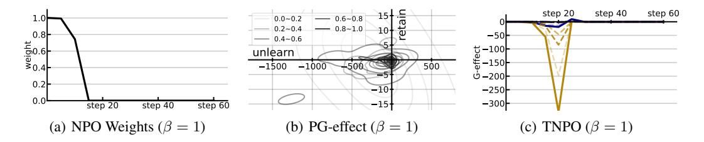
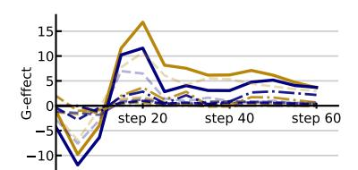
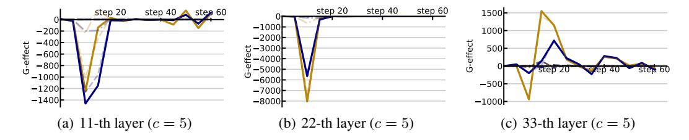

# The gradient effect 
Some immunisation strategies inherit their working principles from machine unlearning. After all, unlearning is almost equivalent to immunisation. The latter has the particularity of being focused not only to robustness against general use, but as we have seen in the definition part, it focuses also on trainability, and robustness against further fine tuning.

In any case, lets revisit what the main unlearning techniques do from a mechanistic point of view.

Adapted from  [*Wang, Qizhou, et al. "Rethinking llm unlearning objectives: A gradient perspective and go beyond." arXiv preprint arXiv:2502.19301 (2025).*](https://arxiv.org/pdf/2502.19301) 

**LLM Unlearning.** the goal is enabling LLMs to eradicate any parameterized knowledge that is undesirable. 

More specifically: 

(a) ensuring the removal of data / knowledge targeted to be unlearned and

(b) retaining the integrity of model responses for non-targeted data. 

Formally, we consider the data distribution  $\mathcal{D}_{\rm u}$  that should be unlearned and define the risk metric  $\mathcal{R}$  to assess model performance. Then, our goal is to adjust the original LLM parameters  $\boldsymbol{\theta}_{\rm o}$  to get the unlearned ones  $\boldsymbol{\theta}_{\rm u}$ , such that:

- **Removal.** The performance on the unlearning dataset  $\mathcal{D}_u$  should significantly deteriorate, i.e.,  $\mathcal{R}(\mathcal{D}_u; \boldsymbol{\theta}_u) \gg \mathcal{R}(\mathcal{D}_u; \boldsymbol{\theta}_o)$ , revealing effective unlearning on data targeted to be erased.
- **Retention.** The performance on other data, i.e.,  $\mathcal{D}_t \setminus \mathcal{D}_u$ , should be maintained or enhanced, i.e.,  $\mathcal{R}(\mathcal{D}_t \setminus \mathcal{D}_u; \theta_u) \leq \mathcal{R}(\mathcal{D}_t \setminus \mathcal{D}_u; \theta_o)$ , ensuring model responses on common data are not damaged.

> Here, we consider a practical objective of erasing targeted knowledge as much as possible, i.e., full removal, slightly diverging from the classical definition of machine unlearning (Bourtoule et al., 2021) that seeks to make models behave as if they were trained without the targeted data, i.e., influence removal. See paper's section V for more info on this. 

Before delving into specific methods, we need proper criteria for assessing whether an objective is suitable for unlearning or not. Recalling our earlier discussion on the main goals of unlearning, we can quantify the performance change before and after unlearning to evaluate their effects, i.e.,  

$$ \mathcal{R}(\mathcal{D}_u;\boldsymbol{\theta}_u) - \mathcal{R}(\mathcal{D}_u;\boldsymbol{\theta}_o)$$
for removal and
$$\mathcal{R}(\mathcal{D}_t \backslash \mathcal{D}_u;\boldsymbol{\theta}_u) - \mathcal{R}(\mathcal{D}_t \backslash \mathcal{D}_u;\boldsymbol{\theta}_o)$$
for retention.

  Sadly, merely comparing performance provides limited insights into understanding the underlying mechanisms (cf., Section 4). Therefore, we suggest a more insightful scheme that can facilitate the analysis of various unlearning methods from a gradient perspective, named the gradient effect (G-effect).

Generally speaking, the G-effect compares the gradients of the unlearning objective  $\mathcal{L}_u$  and the risk metric  $\mathcal{R}$ . If the gradients of  $\mathcal{L}_u$  align in similar directions to  $\mathcal{R}$ , model updating based on  $\mathcal{L}_u$  is capable to enhance model performance measured by  $\mathcal{R}$ , an obvious alternative of  $\mathcal{R}(\mathcal{D}; \theta_u)$  –  $\mathcal{R}(\mathcal{D}; \theta_o)$  to measure the performance change. The degree of such similarity between gradients can be quantified using their dot products (Lopez-Paz & Ranzato, 2017): A positive dot product indicates that  $\mathcal{L}_u$  is capable to improve  $\mathcal{R}$ , whereas a negative dot product suggests potential harm to  $\mathcal{R}$ . It motivates the G-effect as follows.

> **Definition 1** (G-effect). The G-effect  $e^{(t)}$  for an unlearning objective  $\mathcal{L}_u$  at the t-th step of model updating is given by  $\nabla_{\boldsymbol{\theta}} \mathcal{R}(\mathcal{D}; \boldsymbol{\theta}^{(t)})^{\top} \nabla_{\boldsymbol{\theta}} \mathcal{L}_u(\mathcal{D}_u; \boldsymbol{\theta}^{(t)})$
> 
> We further define the unlearning G-effect  
>
>$e^{(t)}_u \leftarrow \nabla_{\boldsymbol{\theta}} \mathcal{R}(\mathcal{D}_u; \boldsymbol{\theta}^{(t)})^{\top} \nabla_{\boldsymbol{\theta}} \mathcal{L}_u(\mathcal{D}_u; \boldsymbol{\theta}^{(t)})$ 
>
> and the retaining G-effect  
>
>$e^{(t)}_r \leftarrow \nabla_{\boldsymbol{\theta}} \mathcal{R}(\mathcal{D}_t \backslash \mathcal{D}_u; \boldsymbol{\theta}^{(t)})^{\top} \nabla_{\boldsymbol{\theta}} \mathcal{L}_u(\mathcal{D}_u; \boldsymbol{\theta}^{(t)})$ 
>
> to reflect the respective goals of removal and retention.

The G-effect measures the impacts of unlearning objectives on either targeted or non-targeted data when implementing gradient updates. Overall, to fulfill the unlearning goals, we aim for notably negative values of  $e_{\rm u}^{(t)}$  to pursue a sufficient removal of targeted knowledge and non-negative values of  $e_{\rm r}^{(t)}$  to maintain the model integrity for non-targeted data. Figure 1 further depicts these two essential gradient conditions to ensure effective unlearning:

- **Removal.** The red region indicates  $e_{\mathrm{u}}^{(t)} < 0$ , ensuring  $\mathcal{L}_{\mathrm{u}}$  to eliminate targeted knowledge.
- Retention. The blue region represents  $e_{\rm r}^{(t)} \geq 0$ , ensuring  $\mathcal{L}_{\rm u}$  to retain the overall model integrity.

Figure 1: Gradient Directions and Unlearning Behaviors. We show directions for  $\nabla_{\boldsymbol{\theta}} \mathcal{R}(\mathcal{D}_{\mathrm{u}}; \boldsymbol{\theta}_{\mathrm{o}})$  and  $\nabla_{\boldsymbol{\theta}} \mathcal{R}(\mathcal{D} \backslash \mathcal{D}_{\mathrm{u}}; \boldsymbol{\theta}_{\mathrm{o}})$  and regions ensuring  $e_{\mathrm{u}}^{(t)} < 0$  (red) and  $e_{\mathrm{r}}^{(t)} \geq 0$  (blue). Their intersection (black dashed) fulfills the unlearning goals.

What Can We Learn from the G-effect? In Figure [1,](#page-2-2) the intersection, delineated by black dashed lines, is the region that meets the primary goals of unlearning. This area highlights the conceptual possibilities of achieving a perfect unlearning objective, under the mild conjecture that ∇θR(Du; θo) will differ from ∇θR(D\Du; θo) more or less. (See paper's Appendix [A](#page-13-0) for more discussions.)

# G-Effect Analysis for LLM Unlearning Objectives

> **Tutorial focus:** Understanding the G-effect as a diagnostic lens for unlearning — this framework also directly informs *immunisation* strategies by revealing which gradient dynamics preserve vs. destroy model integrity.

---

## What is the G-Effect?

The **G-effect** measures the interplay between an unlearning update and model performance on a given dataset $\mathcal{D}$:

- **Unlearning G-effect** (red): how effectively targeted knowledge is erased from the model.
- **Retaining G-effect** (blue): how much collateral damage is done to non-targeted data $\mathcal{D}_t \setminus \mathcal{D}_u$.

Layer-level resolution is also tracked: `embed` (input embedding), `shallow` (layers 1–11), `middle` (layers 12–22), `deep` (layers 23–33), `lm` (output unembedding).

**Setup:** 5% TOFU fictitious unlearning benchmark, Llama-2-7B, 5 epochs (~60 steps), NLL as the risk metric $\mathcal{R}$.

---

## 4.1 Gradient Ascent (GA)

GA is the simplest unlearning objective: directly *decrease* the log-likelihood of unlearning data.

### G-effect over Steps

Section (a) tells us:

- Unlearning G-effect drops rapidly to $\approx -3.5 \times 10^5$ → strong erasure.
- Retaining G-effect mirrors this decline → **severe collateral damage**.
- Near-zero G-effect in later steps does **not** mean recovery; cumulative damage from steps 20–40 is already done. It means only convergence.

section (b) tells us:

- **Shallow layers** (general knowledge): most affected — large negative G-effect.
- **Middle/deep layers** (context-specific knowledge): less affected.
- **Input embedding layer**: negligible impact on both removal and retention.
- **Output unembedding layer (LM)**: large, non-converging G-effect — acts as unbounded scaling for the GA objective.

### Unlearning Mechanism

The gradient of GA is:

$$\mathbb{E}_{s_{\mathbf{u}} \sim \mathcal{D}_{\mathbf{u}}} \sum_{i=2}^{|s|} \frac{1}{p(s_{\mathbf{u}}^{i} | s_{\mathbf{u}}^{< i}; \boldsymbol{\theta})} \nabla_{\boldsymbol{\theta}} p(s_{\mathbf{u}}^{i} | s_{\mathbf{u}}^{< i}; \boldsymbol{\theta}) \tag{1}$$

The **inverse confidence term** $1/p(\cdot)$ amplifies updates for already-unlearned tokens → runaway gradient magnitudes → excessive unlearning.

### Fix: Weighted GA (WGA)
 
Weight each token's log-likelihood by its own confidence:

$$\mathbb{E}_{s_{\mathbf{u}} \sim \mathcal{D}_{\mathbf{u}}} \sum_{i=2}^{|s|} w_{s_{\mathbf{u}},i}^{\text{wga}} \log p(s_{\mathbf{u}}^{i} | s_{\mathbf{u}}^{\leq i}; \boldsymbol{\theta}) \tag{2}$$

with $w_{s_{\mathbf{u}},i}^{\text{wga}} = p(s_{\mathbf{u}}^{i}|s_{\mathbf{u}}^{<i};\boldsymbol{\theta})^{\alpha}$ (confidence weight, $\alpha$ = inverse temperature).

**(See section (c) of the above fig.)**

> WGA effectively functions as **early stopping** on the unlearning extent — the retaining G-effect stays close to zero while unlearning still proceeds.

---

## 4.2 Negative Preference Optimization (NPO)

Motivated by DPO, NPO isolates the *dis-preferred* part of the preference objective:

$$\frac{2}{\beta} \mathbb{E}_{s_{\mathbf{u}} \sim \mathcal{D}_{\mathbf{u}}} \log \left( 1 + \left( \frac{p(s_{\mathbf{u}}; \boldsymbol{\theta})}{p(s_{\mathbf{u}}; \boldsymbol{\theta}_{\mathbf{0}})} \right)^{\beta} \right) \tag{3}$$

where $\beta$ is the inverse temperature and $\boldsymbol{\theta}_0$ is the original model.

### G-effect over Steps

- Converges **much faster** than GA.
- **Smaller magnitude** overall: weaker erasure, but much better integrity preservation.
- For $\beta = 1$ or $2$: retaining G-effect magnitude **outweighs** unlearning G-effect → net positive trade-off.

### Unlearning Mechanism

NPO's gradient decomposes as:

$$\mathbb{E}_{s_{\mathbf{u}} \sim \mathcal{D}_{\mathbf{u}}} \; w_{s_{\mathbf{u}}}^{\mathrm{npo}} \nabla_{\boldsymbol{\theta}} \log p(s_{\mathbf{u}}; \boldsymbol{\theta}) \tag{4}$$

with reweighting:

$$w_{s_{\mathbf{u}}}^{\mathrm{npo}} = \frac{2\, p(s_{\mathbf{u}};\boldsymbol{\theta})^\beta}{p(s_{\mathbf{u}};\boldsymbol{\theta})^\beta + p(s_{\mathbf{u}};\boldsymbol{\theta}_{\mathbf{0}})^\beta}$$

As the model unlearns (confidence $p(s_u;\theta)$ drops), $w_{s_u}^{\text{npo}}$ decreases → **automatic early stopping**, similar to WGA.

### NPO Weighting Analysis (PG-effect decomposition)

Expanding per data-point:

$$\mathbb{E}_{s_{\mathrm{u}} \sim \mathcal{D}_{\mathrm{u}}} \; w_{s_{\mathrm{u}}}^{\mathrm{npo}} \underbrace{\nabla_{\boldsymbol{\theta}} \mathcal{R}(\mathcal{D}; \boldsymbol{\theta}^{(t)}) \nabla_{\boldsymbol{\theta}} \log p(s_{\mathbf{u}}; \boldsymbol{\theta}^{(t)})}_{\text{PG-effect of GA}} \tag{5}$$
So the PG-effect is just the **per-sample** dot product — a scalar for each data point su in Du. You get two flavors:
- **Unlearn PG-effect**: using D = Du → x-axis
- **Retain PG-effect**: using D = Dt\Du → y-axis

Figure 4 in the paper.

>Figure 5 in the paper. The NPO Weighting Mechanisms. We depict the curves of average NPO weights in (a) and the relationship of NPO weights with PG-effect in **(b).** **Distributions of PG-effect for different value ranges of  $w_{s_u}^{\rm npo}$  are depicted, considering the checkpoints at 5, 10, and 15-th steps jointly**. Moreover, darker shades within distribution contours signify the groups of  $w_{s_u}^{\rm npo}$  with overall larger weights. We further depict the G-effect for an improved version of NPO, named TNPO, in (c). The horizontal axes denote the unlearning step for (a) and (c), and the unlearning G-effect for (b). The vertical axes denote the NPO weights for (a), the retaining G-effect for (b), and the G-effect for (c).

> **"we plot the joint distributions for the PG-effect of GA with respect to unlearning (i.e.,  $\mathcal{D} = \mathcal{D}_{\rm u}$ ) and retention (i.e.,  $\mathcal{D} = \mathcal{D}_{\rm t} \setminus \mathcal{D}_{\rm u}$ ) in Figure 5(b)."**

Each data point su thus gets mapped to a **2D coordinate** (unlearn PG-effect, retain PG-effect).

**What are the contours?**

They take all data points across checkpoints at steps 5, 10, 15, group them by their NPO weight range (0–0.2, 0.2–0.4, etc.), and plot the **2D density contour** of where those points land in the (unlearn, retain) plane. Darker shades = higher weight groups.

**The ideal region**

A "good" data point to focus unlearning on should have:
- Large **negative** unlearn PG-effect (far left on x-axis) → actively helps forgetting
- **Near-zero** retain PG-effect (close to 0 on y-axis) → doesn't damage integrity

So ideally, the high-weight contours (darker) should cluster in the **bottom-left**, i.e. large negative x, near-zero y.

**What they actually observe**

The NPO weights partially achieve this — darker contours do tend toward near-zero retain PG-effect, meaning NPO is smart enough to avoid prioritizing points that damage integrity. That's the positive finding.

But there are failure cases — some contours in the 0.4–0.6 weight range land in regions with **notably negative retain PG-effect**, meaning NPO is accidentally upweighting points that do hurt integrity. That's the criticism.

In short, Figure 5(b) is essentially asking: *is NPO's weighting mechanism assigning high weights to the "right" data points?* The contour plot visualizes the answer — partially yes, but with meaningful failures.

**Key finding: (section b of the figure above)** $w_{s_u}^{\text{npo}}$ tends to assign larger weights to data points with **near-zero retaining PG-effect** → prioritises samples that don't damage integrity.

 However:
- Failure cases exist: some points with large unlearning PG-effect receive small weights.
- In the $w \in [0.4, 0.6]$ range, weights are sometimes misallocated to highly damaging points.

### Fix: Token-wise NPO (TNPO)

Apply the NPO weighting at the **token level** for finer control:

$$\mathbb{E}_{s_{\mathbf{u}} \sim \mathcal{D}_{\mathbf{u}}} \sum_{i=2}^{|s_{\mathbf{u}}|} w_{s_{\mathbf{u}},i}^{\text{tnpo}} \log p(s_{\mathbf{u}}^{i}|s_{\mathbf{u}}^{< i}; \boldsymbol{\theta}) \tag{6}$$

with token-level weights:

$$w_{s_{\mathbf{u}},i}^{\mathrm{tnpo}} = \frac{2\, p(s_{\mathbf{u}}^i|s_{\mathbf{u}}^{<i};\boldsymbol{\theta})^{\beta}}{p(s_{\mathbf{u}}^i|s_{\mathbf{u}}^{<i};\boldsymbol{\theta})^{\beta} + p(s_{\mathbf{u}}^i|s_{\mathbf{u}}^{<i};\boldsymbol{\theta}_{\mathrm{o}})^{\beta}}$$

**(see Fig 5.c)**

TNPO achieves: large negative unlearning G-effect + retaining G-effect close to zero → **best of both worlds**.

---

## 4.3 Other Objectives

### Preference Optimization (PO)

Overwrites old knowledge with new outputs rather than erasing them:

$$\mathbb{E}_{s_{\mathbf{u}} \sim \mathcal{D}_{\mathbf{u}}} - \log p(s_{po}|s^{< i}; \boldsymbol{\theta}) \tag{7}$$

⚠️ **Problem:** Unlearning efficacy is limited to early steps; in later steps, PO may inadvertently **facilitate knowledge relearning**.

---

### Representation Misdirection for Unlearning (RMU)

Perturbs internal model representations by pushing them toward a random vector:

$$\mathbb{E}_{s_{\mathbf{u}} \sim \mathcal{D}_{\mathbf{u}}} \frac{1}{|s| - 1} \sum_{i=1}^{|s| - 1} ||\phi(s^{< i}; \boldsymbol{\theta}) - c \cdot \mathbf{u}||_{2}^{2} \tag{8}$$

where $\mathbf{u}$ is a random vector (elements $\sim \text{Uniform}[0,1)$) and $c$ is a scaling hyperparameter.

- **Highly sensitive** to layer choice: middle layers (22nd) outperform shallow or deep.
- **Highly sensitive** to $c$: wrong $c$ can be completely counterproductive.
- Like vanilla GA: improvements in unlearning come at **similar cost to general utility** → another form of excessive unlearning.

---

## Summary Table

| Method | Unlearning Strength | Integrity Preservation | Key Mechanism | Main Issue |
|--------|--------------------|-----------------------|---------------|------------|
| **GA** | ✅ Very strong | ❌ Very poor | Inverse confidence amplification | Excessive unlearning |
| **WGA** | ✅ Controlled | ✅ Better | Confidence-weighted early stopping | Hyper-parameter sensitivity |
| **NPO** | ⚠️ Moderate | ✅ Good | Sequence-level reweighting | Misallocation in mid-weight range |
| **TNPO** | ✅ Strong | ✅ Best | Token-level reweighting | — |
| **PO** | ⚠️ Early only | ✅ OK | Knowledge overwriting | Relearning risk |
| **RMU** | ⚠️ Sensitive | ❌ Poor | Representation perturbation | Config sensitivity, excessive updates |

---

## Connection to Immunisation

> The G-effect framework reveals a core tension: **effective unlearning requires large gradient updates, but large updates damage model integrity**. Immunisation strategies must navigate the same tension — but *in advance*, by making the model resistant to undesired knowledge acquisition without corrupting its general capabilities. Methods like TNPO, which achieve selective token-level gradient control, are the most promising candidates for informing immunisation objectives.
